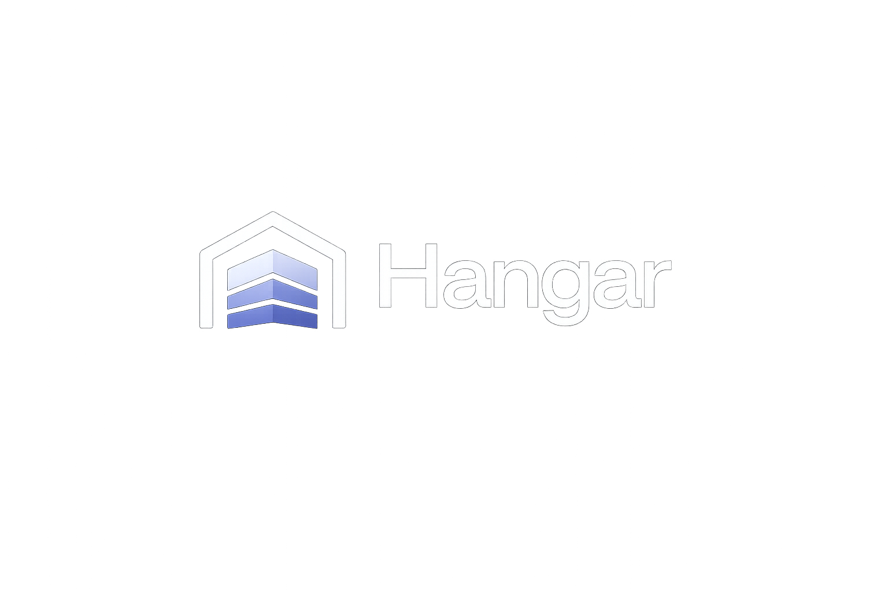

<p align="center">
  
</p>

<p align="center">
  <a href="https://github.com/szymczag/hangar/actions/workflows/pull-request-build-lint-web-apps.yml"></a>
  <a href="https://github.com/szymczag/hangar/actions/workflows/api-tests.yml"></a>
  <a href="./LICENSE.txt"></a>
  <a href="https://github.com/szymczag/hangar/issues"></a>
</p>

# Hangar

Hangar is an independent, community-maintained fork of
[Plane](https://github.com/makeplane/plane), focused on extending the open-source
project-management core while keeping upstream updates practical.

> [!IMPORTANT]
> Hangar is under active development. It does not currently publish stable releases,
> hosted services, or production-ready container images. The `preview` branch is the
> integration branch for contributors.

Hangar is not affiliated with, endorsed by, or supported by Plane Software, Inc.
“Plane” and the Plane logo are trademarks of Plane Software, Inc.

## Project status

| Capability                             | Status                 | Tracking                                                                            |
| -------------------------------------- | ---------------------- | ----------------------------------------------------------------------------------- |
| Fork maintenance guide and CI baseline | Available on `preview` | [FORK.md](FORK.md)                                                                  |
| Isolated backend extension scaffold    | Available on `preview` | [#2](https://github.com/szymczag/hangar/pull/2)                                     |
| OIDC backend                           | Available on `preview` | [#3](https://github.com/szymczag/hangar/pull/3)                                     |
| OIDC administration and sign-in UI     | In review              | [#4](https://github.com/szymczag/hangar/pull/4)                                     |
| SAML 2.0 backend and UI                | Stacked                | [#5–#6](https://github.com/szymczag/hangar/pulls?q=is%3Apr+is%3Aopen+SAML)          |
| Epics                                  | Stacked                | [#7, #9, #14](https://github.com/szymczag/hangar/pulls?q=is%3Apr+is%3Aopen+epic)    |
| Custom work-item types and properties  | Stacked                | [#10–#11](https://github.com/szymczag/hangar/pulls?q=is%3Apr+is%3Aopen+issue-types) |
| Time tracking and worklogs             | Stacked                | [#12–#13](https://github.com/szymczag/hangar/pulls?q=is%3Apr+is%3Aopen+worklogs)    |

“In review” means the code is not yet part of the supported `preview` branch. Do not
plan a deployment around those capabilities until their pull requests have merged and
the table marks them as available.

> [!NOTE]
> Hangar's OIDC backend requires TLS 1.3 for discovery, token, JWKS, and userinfo
> connections. Identity providers or reverse proxies limited to TLS 1.2 are not
> supported.

## Development quick start

### Requirements

- Docker Engine with Docker Compose
- Node.js 22.18 or newer
- Corepack (the repository pins its pnpm version)
- At least 12 GB of RAM recommended for the complete local stack

Clone the fork and prepare the local environment:

```sh
git clone https://github.com/szymczag/hangar.git
cd hangar
./setup.sh
```

Start the local infrastructure, then the application development servers:

```sh
docker compose -f docker-compose-local.yml up -d
pnpm dev
```

The web application runs at <http://localhost:3000>; instance administration runs at
<http://localhost:3001/god-mode/>.

For repository commands, testing expectations, and contribution workflow, see
[CONTRIBUTING.md](CONTRIBUTING.md). This quick start is for development, not a
production deployment guide.

## Fork architecture and upstream relationship

Fork-owned backend code is isolated in `apps/api/plane/ext/`, while frontend extensions
use the existing community-edition overlay and extension points. Necessary changes to
upstream-owned files are deliberately small and tracked in a core-touch ledger.

[FORK.md](FORK.md) explains the architecture, upstream synchronization workflow,
copyright-header policy, and complete core-touch ledger. Hangar follows Plane’s
`preview` branch using merge-based synchronization; it does not rewrite published fork
history.

For Plane itself, its hosted service, or upstream documentation, visit the
[Plane repository](https://github.com/makeplane/plane). Issues caused by Hangar should
be reported to Hangar rather than Plane.

## Participate

- Read [CONTRIBUTING.md](CONTRIBUTING.md) before opening an issue or pull request.
- Report bugs and propose features in [Hangar Issues](https://github.com/szymczag/hangar/issues).
- Report vulnerabilities privately according to [SECURITY.md](SECURITY.md).
- Follow the [Code of Conduct](CODE_OF_CONDUCT.md) in project spaces.

## License and attribution

Hangar is licensed under the [GNU Affero General Public License v3.0](LICENSE.txt).
It is derived from [Plane](https://github.com/makeplane/plane) and retains upstream
copyright and license notices. Hangar-specific changes are maintained by Maciej
Szymczak and contributors.
