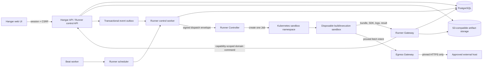

# Hangar Runner architecture and implementation plan

Status: the Phase 1 installation control-plane foundation is available on
`preview`; Runner execution is not implemented or supported.

Last reviewed: 2026-07-14.

## Implementation status

The first Phase 1 slice landed through PRs
[#46](https://github.com/szymczag/hangar/pull/46) and
[#48](https://github.com/szymczag/hangar/pull/48):

- `RUNNER_ENABLED` is a process-level operator gate and defaults to `0`; disabled
  endpoints fail closed with `404 runner_disabled`, and changing the setting
  requires an application restart;
- absence of a `RunnerInstallation` row is the only inactive representation;
  persisted lifecycle states are `active`, `suspended`, and terminal `revoked`,
  while stale consent produces the non-persisted effective state
  `consent_required`;
- activation requires the exact current consent version and SHA-256 digest; the
  canonical versioned text is retained in an immutable contract registry and
  returned by the read endpoint; all transitions are serialized by a database
  lock on the workspace;
- authorization is enforced in the service boundary and rechecked under the
  mutation transaction; unauthorized and nonexistent workspace slugs return the
  same response, and only active workspace Admins can read or change state;
- read and mutation requests use separate aggregate-user and user/workspace rate
  limits, configurable through the `RUNNER_API_*_RATE` settings;
- state transitions and allow-listed audit events commit atomically; audit
  records retain workspace and actor UUID evidence plus bounded request context
  after source-row deletion, and PostgreSQL rejects audit updates and deletes;
- revocation cannot be reversed through the API; and
- contract tests cover the instance gate, role and tenant boundaries, direct
  service authorization, consent renewal, lifecycle constraints, idempotency,
  throttling, concurrency, audit rollback/retention, and database immutability;
  a separate CI job applies the real migration chain and exercises the additive
  foundation-upgrade path, constraints, and trigger.

The current API contract is:

| Method | Path                                                  | Behavior                                            |
| ------ | ----------------------------------------------------- | --------------------------------------------------- |
| `GET`  | `/api/workspaces/{slug}/runner/installation/`         | Read effective installation state                   |
| `POST` | `/api/workspaces/{slug}/runner/installation/`         | Activate/reactivate with consent version and digest |
| `POST` | `/api/workspaces/{slug}/runner/installation/suspend/` | Suspend new Runner activity                         |
| `POST` | `/api/workspaces/{slug}/runner/installation/revoke/`  | Irreversibly revoke installation                    |

This slice intentionally cannot accept, compile, dispatch, or execute source
code. The remaining Phase 1 schema, crypto, protocol, execution-state, quota,
outbox, and reconciliation work remains pending.

## Purpose and audience

This document defines the target architecture, security contract, implementation
sequence, and release evidence required to add Hangar Runner to the Hangar fork.
It is an explanation for Hangar maintainers, security reviewers, platform
engineers, and operators who will implement or approve the feature.

Hangar Runner is the Hangar-native implementation of the custom script capability
described by the upstream [Plane Runner documentation](https://docs.plane.so/automations/plane-runner).
The product behavior should be familiar to users of that feature, but this plan
does not assume access to, or compatibility with, Plane's private Enterprise
implementation.

The words **must**, **must not**, **required**, and **supported** are normative.
A feature is not supported merely because it works in a developer environment.
Support begins only after every security and release gate assigned to its delivery
phase has passed against the exact images and chart version being published.

## Decision summary

| Area                 | Decision                                                                                                                                                                |
| -------------------- | ----------------------------------------------------------------------------------------------------------------------------------------------------------------------- |
| Product boundary     | Optional workspace feature, disabled at the instance level by default                                                                                                   |
| Control plane        | Django models and APIs under `plane.ext.runner`, with dedicated Celery queues and workers                                                                               |
| Execution plane      | One build or execution per disposable sandbox; never execute user code in API, Live, or Celery processes                                                                |
| Production isolation | Kubernetes Job in an empty, dedicated namespace using a required sandbox `RuntimeClass` such as gVisor or Kata Containers                                               |
| Developer isolation  | Explicitly unsafe, trusted-code-only development executor; disabled by default                                                                                          |
| Runtime              | Digest-pinned minimal Node.js image; TypeScript is compiled to an immutable JavaScript artifact before publication                                                      |
| Network              | Sandbox egress is default-deny; SDK calls and HTTP requests pass through trusted gateways                                                                               |
| Credentials          | Short-lived, execution-bound capability tokens; never a user's API token or a general service token                                                                     |
| Secrets              | Envelope-encrypted at rest and injected only into runtime memory; the platform never places plaintext in a Pod environment, Job spec, artifact, or persisted log/result |
| Events               | Transactional outbox with a versioned event catalog and explicit emitters                                                                                               |
| Delivery semantics   | At-least-once dispatch with idempotent execution creation and SDK mutation keys                                                                                         |
| Versioning           | Published script and function versions are immutable; triggers pin exact versions                                                                                       |
| Initial scope        | Test runs, event triggers, cron triggers, SDK operations, proxied HTTPS, logs, audit, and quotas                                                                        |
| Deferred scope       | Synchronous workflow pre-validation until Hangar has server-enforced workflow transitions and the required latency/availability evidence                                |

## Baseline in the current fork

At the initial assessment, Hangar had two project-level maintenance automations: automatic archive
and automatic close. They are stored as project configuration and executed by a
daily Celery task. The Community Edition custom-automation component is an empty
overlay, and there were no Runner routes, script models, execution records,
sandbox services, or deployment resources. The activation control-plane slice
described above now exists; script models, execution records, sandbox services,
and deployment resources do not. The existing `Hangar Runner` locale strings are
not an execution implementation.

The implementation must preserve the fork boundaries described in `FORK.md`:

- backend models, serializers, views, tasks, and most new URLs live under
  `apps/api/plane/ext/runner/`;
- frontend implementation lives under `apps/web/ce/`, filling the current CE
  overlays where practical;
- shared types and UI primitives remain in their existing packages;
- core edits are append-only integration points and are recorded in the fork
  ledger; and
- every change under `charts/hangar/**` includes substantive, corresponding
  updates to `docs/kubernetes/README.md` and any other affected Kubernetes guide.

Existing architecture that the design can reuse includes:

- Django 4.2 and PostgreSQL for the control plane;
- Celery, RabbitMQ, Valkey/Redis, and `django-celery-beat` for trusted background
  coordination;
- S3-compatible object storage for immutable build artifacts and bounded logs;
- SSRF-resistant, DNS-pinned HTTP request utilities used by webhook delivery;
- transactional `on_commit` and idempotent outbox patterns used by secure email;
- React Router, MobX, shared services/types, and the CE frontend overlay; and
- a Helm chart with non-root containers, read-only root filesystems,
  default-deny network policy, and external production dependencies.

These are useful building blocks, not a security boundary for untrusted code.
The general Celery worker and existing application containers hold credentials
that user scripts must never be able to reach.

## Goals

The target feature provides:

1. Workspace-admin activation with explicit consent and instance-level feature
   control.
2. JavaScript and TypeScript scripts with immutable published versions.
3. Reusable, versioned workspace functions and read-only system functions.
4. Test, event, cron, workflow post-action, and eventually workflow
   pre-validation triggers.
5. A typed Hangar SDK for explicitly approved read and write capabilities.
6. Script variables, encrypted secret bindings, and exact HTTPS destination
   allowlists.
7. Build diagnostics, execution results, bounded logs, metrics, and audit history.
8. Deterministic retries, concurrency controls, causal-chain loop prevention,
   quotas, cancellation, and cleanup.
9. A production deployment that contains a total Node.js/runtime compromise
   without exposing Hangar infrastructure credentials or another execution.

## Non-goals

The first supported implementation does not provide:

- arbitrary npm dependencies, dynamic imports, filesystem access, child
  processes, listening sockets, or native extensions;
- arbitrary container images or user-supplied runtime flags;
- general-purpose CI/CD, long-running services, interactive shells, or browser
  automation;
- exact-once side effects across Hangar and external systems;
- unrestricted access to private networks or cloud metadata services;
- a production-grade process-only or Docker-socket executor;
- cross-workspace functions, secrets, events, or execution inspection;
- source compatibility with undocumented Plane Enterprise internals; or
- workflow pre-validation before Hangar has a transactional, server-enforced
  workflow-transition service.

## Security invariants

The design is acceptable only while all of these invariants remain true:

1. User-controlled source is never evaluated, imported, type-checked, or bundled
   inside the API, Live, general Celery worker, beat worker, or browser server.
2. A sandbox receives no database, Valkey, RabbitMQ, object-storage, SMTP,
   telemetry, Kubernetes, Django, or instance signing credential.
3. The runtime isolation boundary assumes the script can fully compromise Node.js
   and the runtime wrapper. AST checks and removed globals are defense in depth,
   not the primary sandbox.
4. Every build and execution uses a new disposable sandbox. A sandbox is never
   reassigned to another execution or workspace.
5. Published source, function dependencies, SDK version, policy, runtime image,
   and artifact digest are immutable and attributable to the approving admin.
6. Every Hangar SDK operation is authorized against an execution-bound
   capability, workspace, optional project set, method, and resource scope.
7. A script cannot open an unrestricted network connection. All allowed external
   HTTPS traffic is mediated by the egress gateway and revalidated at connection
   time.
8. Secrets are never returned by public read APIs or intentionally placed in Job
   specs, OS environment variables, command lines, artifacts, results, logs,
   traces, or error messages. Direct plaintext occurrences are rejected or
   redacted before persistence; transformed exfiltration remains part of the
   approved-script threat model.
9. Trigger matching and execution creation are tenant-scoped and idempotent.
10. Runner-originated mutations retain a causal chain so loops can be detected
    and stopped across scripts.
11. Runner failure does not stop ordinary Hangar writes. Synchronous transition
    validation is the only eventual exception and must have a separately approved
    availability contract.
12. Disabling Runner prevents new dispatch immediately and supports revoking all
    outstanding capabilities without deleting audit evidence.

## Threat model

### Protected assets

- workspace content and membership data;
- credentials and secrets configured for scripts or Hangar itself;
- integrity of work items, projects, comments, labels, workflows, and audit data;
- availability of the API, workers, queue, database, cluster, and external
  destinations;
- confidentiality and integrity of source, compiled artifacts, inputs, results,
  and logs; and
- isolation between workspaces and between concurrent executions.

### Threat actors and required controls

| Threat                                                | Required control                                                                                                                                                                        |
| ----------------------------------------------------- | --------------------------------------------------------------------------------------------------------------------------------------------------------------------------------------- |
| Malicious workspace admin writes hostile code         | Treat runtime compromise as expected; contain it with the sandbox, capabilities, egress policy, quotas, and audit                                                                       |
| Member causes a trigger with crafted entity data      | Treat every event field as untrusted input; use typed payloads, output encoding, and no implicit code construction                                                                      |
| Compromised sandbox probes internal services          | Default-deny sandbox networking; allow only Runner Gateway, egress gateway, and DNS; block metadata and private ranges                                                                  |
| Script attempts workspace or project escape           | Capability includes immutable workspace/project scope; gateway rechecks every object and never trusts an ID alone                                                                       |
| Script exfiltrates a bound secret                     | Exact admin-approved destinations, consent warnings, audit, rotation, and minimal secret binding; this risk cannot be eliminated when a script is intentionally allowed to use a secret |
| External host performs DNS rebinding or redirect SSRF | Resolve and validate at request time, pin the connection IP, verify TLS hostname, and revalidate every redirect or disable redirects                                                    |
| Queue message is duplicated, reordered, or replayed   | Signed dispatch envelope, unique idempotency keys, monotonic state transitions, short expiry, and attempt records                                                                       |
| Artifact or function changes after approval           | Content digest, signed build manifest, immutable object key, version pinning, and signature verification before execution                                                               |
| Compromised Runner Controller abuses Kubernetes       | Controller has no application secrets; its Role is limited to Jobs in an empty sandbox namespace protected by Restricted Pod Security, quota, policy, and an approved RuntimeClass      |
| Compromised general worker tries to mint executions   | Separate signing keys and authorization; dispatcher actions remain audited, rate-limited, and reconciled                                                                                |
| Runaway or intentionally expensive code               | Wall-clock, CPU, memory, PID, output, request, execution-count, and workspace concurrency limits enforced outside the process                                                           |
| Logs leak secrets or personal data                    | Structured bounded logging, exact-value redaction before persistence, field denylist, retention limits, and admin-only access                                                           |
| Supply-chain compromise of runtime or compiler        | Digest pins, SBOM, vulnerability scanning, provenance/signature verification, minimal images, lockfiles, and release qualification                                                      |

Workspace admins are trusted to authorize workspace-scoped effects. Runner cannot
prevent an authorized admin from deliberately sending data to a destination they
control. It must make the permission, destination, secret, and resulting
execution visible and attributable.

## Target architecture

### Control and execution planes



The trusted control plane decides what may run and records why. The untrusted
execution plane runs only an immutable artifact under an execution capability.
No component is both a script runtime and a holder of Hangar infrastructure
credentials.

### Components

| Component              | Responsibility                                                                                        | Credentials and access                                                                                                        |
| ---------------------- | ----------------------------------------------------------------------------------------------------- | ----------------------------------------------------------------------------------------------------------------------------- |
| Runner control API     | Activation, CRUD, version publication, trigger management, tests, executions, audit                   | Normal Django application credentials; public session authentication; no Kubernetes access                                    |
| Runner event publisher | Write versioned domain events in the same transaction as supported mutations                          | Database only through the API process                                                                                         |
| Runner control worker  | Claim outbox events, match triggers, create executions, enforce quotas, request builds and dispatches | PostgreSQL, Valkey, RabbitMQ, object storage as required; no Kubernetes token                                                 |
| Runner scheduler       | Claim due cron triggers and create idempotent executions                                              | PostgreSQL and RabbitMQ; implemented as a fixed periodic control task                                                         |
| Runner Controller      | Verify dispatch envelopes, render fixed Job specs, observe Jobs, cancel/reap them                     | Narrow Kubernetes ServiceAccount; no database, queue, object-storage, or Hangar application secret                            |
| Runner Gateway         | Deliver bundles and in-memory secrets, accept results/logs, mediate SDK calls                         | Runner encryption/signing material, database/object storage as needed, and a private application channel; no Kubernetes token |
| Egress Gateway         | Implement the sandbox `fetch` contract with DNS pinning, TLS, domain policy, and size/time limits     | No workspace secrets at rest; receives per-request execution capability; outbound HTTPS                                       |
| Build sandbox          | Validate and compile one draft version; produce diagnostics and artifact                              | One-use bootstrap capability; no secrets or general egress                                                                    |
| Execution sandbox      | Execute one published artifact and submit logs/result                                                 | One-use execution capability and the bound secrets returned into memory; no infrastructure credential                         |

The Runner Gateway and egress gateway may share a deployment during an internal
prototype, but they should remain separate modules, routes, policies, metrics,
and scaling controls. They have different exposure and failure modes. Production
support requires independent resource limits and the ability to disable external
egress while preserving SDK execution.

### Trust boundaries

1. **Browser to public API:** normal Hangar session authentication, CSRF, role
   checks, schema validation, and throttling apply.
2. **Control plane to Controller:** mutually authenticated internal request plus a
   short-lived Ed25519-signed dispatch envelope. Network location alone is not
   authentication.
3. **Controller to Kubernetes:** namespace-scoped Job operations only. The target
   namespace contains no application Secret.
4. **Sandbox to Runner Gateway:** one-use, execution-bound capability plus network
   policy. The gateway treats the sandbox as hostile.
5. **Sandbox to external network:** only through the egress gateway. Standard
   Kubernetes NetworkPolicy must make direct traffic fail even after total Node
   compromise.
6. **Gateway to Hangar domain operations:** capability is translated into an
   internal service identity and explicit domain command, never a human session or
   unrestricted API token.

## Isolation architecture

### Production decision

The supported production executor is a disposable Kubernetes Job running under a
sandboxing `RuntimeClass` backed by a user-space kernel or microVM isolation layer.
The exact supported implementations must be qualified, but the interface should
support at least gVisor and Kata Containers.

A normal container with Restricted Pod Security is useful hardening but is not a
sufficient supported boundary for hostile code because it shares the node kernel.
The chart must therefore fail validation when Runner is enabled in production and
`runner.runtimeClassName` is empty. Operators must preinstall and qualify the
runtime; the Hangar chart does not install a cluster runtime.

Each build or execution creates a new Job and Pod. The Pod must use:

- a runtime image pinned by manifest digest;
- `runAsNonRoot`, fixed UID/GID, `allowPrivilegeEscalation: false`, all
  capabilities dropped, and `seccompProfile: RuntimeDefault` or a stricter tested
  profile;
- a read-only root filesystem and a small, memory-backed, `noexec` temporary
  volume;
- `automountServiceAccountToken: false` and `enableServiceLinks: false`;
- no Secret, ConfigMap, host namespace, host path, device, socket, or persistent
  volume mount;
- fixed CPU, memory, PID, ephemeral-storage, and active-deadline limits;
- no ingress and default-deny egress except the Runner Gateway, egress gateway,
  and cluster DNS; and
- `restartPolicy: Never`, bounded Job retries, and prompt TTL cleanup.

Build and execution Jobs use different labels, capability audiences, deadlines,
and egress policies. A build sandbox cannot request secrets or SDK mutations. An
execution sandbox cannot compile arbitrary replacement source.

### Controller containment

The Runner Controller needs permission to create Jobs, which is sensitive even
when namespace-scoped. Production deployment must use two namespaces:

- the normal Hangar namespace contains the API, workers, gateways, Controller,
  and application Secrets; and
- a dedicated Runner sandbox namespace contains no Secrets and is labeled for
  Kubernetes Pod Security `restricted` enforcement.

The Controller receives a RoleBinding in only the sandbox namespace. The Role
allows create/get/list/watch/delete for Jobs and get/list/watch for their Pods only
if observation requires it. It does not allow Secret, ConfigMap, ServiceAccount,
Role, RoleBinding, exec, attach, port-forward, or log access. Sandboxes send logs
to the Gateway, so Kubernetes Pod-log access should not be needed.

Restricted Pod Security, ResourceQuota, LimitRange, default-deny NetworkPolicy,
an empty namespace, and the sandbox RuntimeClass remain mandatory because RBAC
alone cannot constrain the fields of a Pod template. A compromised Controller
must still be unable to mount application Secrets, reach application dependencies,
or create a privileged host workload.

### Alternatives considered

| Option                                                                 | Decision                             | Reason                                                                                                  |
| ---------------------------------------------------------------------- | ------------------------------------ | ------------------------------------------------------------------------------------------------------- |
| `eval`, `vm`, `isolated-vm`, or a Node worker thread inside API/worker | Rejected                             | A JavaScript engine or process escape exposes Hangar credentials and other tenants                      |
| Long-lived multi-tenant Node sandbox pool                              | Rejected for initial release         | Lower latency does not justify residual state and cross-execution risk                                  |
| Ordinary Kubernetes container only                                     | Development/evaluation evidence only | Strong hardening, but the host kernel remains the production isolation boundary                         |
| Per-execution gVisor/Kata Job                                          | Selected                             | Clear lifecycle, cgroup enforcement, empty filesystem, strong containment, and auditable cluster policy |
| Firecracker service managed by Hangar                                  | Deferred                             | Strong isolation but adds a substantial VM orchestration and image-management subsystem                 |
| Docker socket mounted into a Controller                                | Rejected                             | Socket access is effectively host-root and cannot be safely delegated to the application                |
| External executor API                                                  | Future extension                     | Viable if it implements the same signed dispatch, capability, result, and conformance contracts         |

### Warm execution for workflow validation

Per-execution Job startup is appropriate for asynchronous event and cron scripts
but may not meet an interactive workflow-transition latency budget. Synchronous
pre-validation must not weaken isolation to solve latency.

If later measurements require warm capacity, the Controller may maintain a pool
of unassigned sandbox Pods. A warm Pod must:

- contain no workspace data or capability before assignment;
- accept exactly one signed execution lease;
- run one execution and then terminate, regardless of result;
- never return to the pool; and
- use the same RuntimeClass, resource, credential, and network restrictions as a
  Job.

This is pre-created single-use capacity, not sandbox reuse.

## Script and function lifecycle

### Draft, build, publish, and retire

Scripts and functions use immutable versioning:

1. An admin creates or edits a mutable draft.
2. Saving the draft validates size and schema but never executes source.
3. A build request creates a build record and disposable build sandbox.
4. The build sandbox parses, type-checks, and bundles source without network or
   secrets.
5. The control plane stores diagnostics and an immutable artifact by digest.
6. Publishing presents the exact requested SDK capabilities, function versions,
   domains, variables, and secret aliases for approval.
7. Approval signs the build manifest and makes the version immutable.
8. Triggers pin that exact published version. Editing creates a new draft and
   cannot alter active executions.
9. Retiring prevents new trigger attachment but preserves referenced versions and
   audit evidence. Deletion is a tombstone plus retention workflow, not an
   immediate cascade.

Any change to source, script type, runtime version, SDK version, function
dependency, allowed domain, resource profile, requested capability, variable
schema, or secret alias invalidates the old build and requires a new publication.
Changing only a trigger's non-secret variable values does not rebuild the script
but does create an auditable trigger revision.

### Build pipeline

The initial language contract supports JavaScript and TypeScript with a single
entry point:

```typescript
export async function main(input: AutomationEventInput, variables: Record<string, string>): Promise<unknown> {
  return { success: true };
}
```

Cron scripts receive a typed schedule input rather than omitting context entirely;
test runs receive an explicitly marked test context. This keeps the ABI stable and
makes provenance available to every script.

The build pipeline must:

- enforce UTF-8 source and conservative source, schema, dependency-count, and
  artifact-size limits;
- parse with a pinned compiler version in the build image;
- reject imports, dynamic import, CommonJS, source maps with embedded source,
  top-level side effects outside declarations, multiple entry points, and
  unsupported syntax;
- require the expected exported `main` signature for the script type;
- resolve `Functions.*` references only from an explicit dependency map and pin
  exact function-version digests;
- generate TypeScript declarations for `Hangar`, `Functions`, `ENV`, `variables`,
  event schemas, and result types from the selected SDK version;
- run static security rules for obvious dynamic evaluation, Node built-ins,
  prototype manipulation, unbounded literal loops, and unsupported globals;
- bundle to one deterministic ESM artifact with no external imports;
- produce a canonical manifest containing all inputs, limits, policy, dependency
  digests, compiler/runtime/SDK versions, and artifact SHA-256; and
- upload the artifact under a content-addressed, immutable object key.

Static security checks provide useful diagnostics and reduce accidents. They must
not be treated as containment; the execution sandbox assumes a malicious artifact
or compiler exploit.

The control plane signs the canonical manifest with a purpose-specific Ed25519
artifact-signing key after publication approval. The runtime verifies the
signature, artifact digest, execution/version binding, and runtime compatibility
before loading code. Key identifiers and rotation overlap are recorded in the
manifest.

### Functions

Functions have a name, category, description, parameter JSON Schema, return JSON
Schema, source, and immutable versions. There are two classes:

- **workspace functions** are compiled into the same artifact and run inside the
  same sandbox and limits as the calling script; and
- **system functions** are versioned SDK/gateway operations maintained by Hangar,
  such as adding a comment or posting a mediated HTTP request.

Workspace functions may call pure workspace functions, but the dependency graph
must be acyclic and capped in depth and count. A script publication pins the
transitive function graph. System functions declare the SDK capability they
require; using one adds that capability to the publication consent screen.

Function source is not dynamically discovered at execution time. `Functions.foo`
is resolved during the build so a later function edit cannot change a published
script.

## Runtime contract

### Bootstrap

The Controller places only these non-secret values in the Job specification:

- execution ID;
- gateway origin or service address;
- one-use bootstrap capability with an expiry shorter than the Job deadline;
- expected artifact and manifest digests; and
- execution mode (`build`, `test`, or `run`).

The bootstrap token is not a Hangar API credential. It is audience-restricted to
the Runner Gateway, bound to one execution and attempt, and unusable after bundle
delivery or expiry.

At startup, the runtime:

1. sends the bootstrap capability to the Gateway;
2. receives the signed manifest, artifact, typed input, non-secret variables, and
   bound secrets over the private channel;
3. verifies the manifest signature and all digests;
4. keeps secrets in memory and exposes them through the `ENV` proxy;
5. installs only the approved globals;
6. executes `main` under an inner timer and the outer Pod deadline; and
7. posts bounded structured logs and a terminal result before exiting.

The Pod environment must never contain script secrets, source, event payloads, or
reusable SDK, egress, or result credentials. The one-use, execution-bound bootstrap
token is the sole credential permitted in the Job specification; it is consumed
before source loads and cannot authorize any operation after bundle delivery. The
runtime must overwrite mutable secret buffers where practical before exit,
although sandbox destruction is the primary cleanup.

### Available globals

The initial runtime exposes:

- safe standard ECMAScript data types and utilities;
- `Hangar`, a versioned SDK proxy;
- `Functions`, containing only build-resolved functions;
- `ENV`, a read-only object of explicitly bound secrets;
- `fetch`, a proxy implementation backed by the egress gateway;
- `workspaceSlug` and a read-only execution context;
- bounded `console` methods; and
- callback-only timers constrained by the execution deadline.

The product documentation should retain the familiar `Plane` global only if an
explicit compatibility alias is approved. New Hangar examples and types should
use `Hangar`; silently branding new public APIs as Plane would create a permanent
fork contract.

The runtime does not intentionally expose `process`, `Buffer`, `require`,
`module`, dynamic import, Node built-ins, WebAssembly, inspector, worker threads,
native addons, filesystem APIs, raw sockets, environment variables, or dynamic
code constructors. Runtime flags should enable the stable Node permission model
where supported. These restrictions reduce accidental misuse but do not replace
the outer sandbox.

### Inputs and outputs

Every input includes:

- schema version and trigger type;
- event or schedule identifier and occurrence time;
- workspace and optional project identifiers;
- entity type and identifier;
- a minimal, versioned event payload and permitted previous attributes;
- initiator and causal-chain metadata; and
- execution, trigger, and script-version identifiers.

Events should contain identifiers and a conservative changed-field snapshot, not
an unrestricted serialization of the database object. Scripts use the SDK when
they need current state. This reduces stale data, payload size, and accidental
disclosure.

The return value must be JSON-serializable, contain no cycles, and fit the result
size limit. Unsupported values produce a stable user-code error. Error responses
use a public error code and sanitized message; internal stack traces remain in
restricted diagnostic telemetry, not browser-visible results.

### Default limits

Initial defaults are deliberately conservative and instance-configurable only
within hard-coded safety ceilings:

| Limit                      |        Default | Hard ceiling |
| -------------------------- | -------------: | -----------: |
| Execution wall time        |     10 seconds |   30 seconds |
| Build wall time            |     20 seconds |   60 seconds |
| CPU                        | 500 millicores |      2 cores |
| Memory                     |        128 MiB |      512 MiB |
| PIDs                       |             32 |           64 |
| Writable temporary storage |         16 MiB |       64 MiB |
| Source                     |        256 KiB |        1 MiB |
| Bundled artifact           |          1 MiB |        5 MiB |
| Input                      |        256 KiB |        1 MiB |
| Result                     |         64 KiB |      256 KiB |
| Log event                  |          8 KiB |       16 KiB |
| Logs per attempt           |        256 KiB |        1 MiB |
| External requests          |             10 |           50 |
| Request body               |        256 KiB |        1 MiB |
| Response body              |          1 MiB |        5 MiB |

The cgroup/Job limits are authoritative. JavaScript timers and counters improve
error reporting but cannot be the only enforcement mechanism.

## Control-plane data model

Runner models should live in `plane.ext.runner.models` and use UUID primary keys,
workspace foreign keys, explicit database table names, and the existing audit
fields where appropriate. Security and execution evidence must not inherit casual
soft-deletion behavior that can hide active references; those records use explicit
states and retention timestamps.

### Configuration and source models

| Model                      | Important fields and constraints                                                                                                                                                                                                                                                                                                        |
| -------------------------- | --------------------------------------------------------------------------------------------------------------------------------------------------------------------------------------------------------------------------------------------------------------------------------------------------------------------------------------- |
| `RunnerInstallation`       | At most one per workspace; absence means inactive and persisted `state` is `active`, `suspended`, or terminal `revoked`; exact consent version/document/digest; immutable actor UUID and time evidence for lifecycle transitions; database coherence constraints; no soft deletion. Default quotas and service identity remain pending. |
| `RunnerScript`             | Workspace, stable name/slug, description, status, current draft and published version IDs; unique live name per workspace                                                                                                                                                                                                               |
| `RunnerScriptVersion`      | Script, monotonic version, language, script type, source, source digest, schemas, requested capabilities, allowed domains, resource profile, runtime/SDK versions, build and publication state, approver/time; unique `(script, version)` and immutable after publication                                                               |
| `RunnerFunction`           | Workspace, stable name, category, description, status, current draft/published version; unique live name per workspace                                                                                                                                                                                                                  |
| `RunnerFunctionVersion`    | Function, monotonic version, source/digest, parameter and return schemas, build/publication metadata; immutable after publication                                                                                                                                                                                                       |
| `RunnerFunctionDependency` | Owning script/function version, exact dependency version, alias, digest; unique alias per owner and acyclic graph validation                                                                                                                                                                                                            |
| `RunnerArtifact`           | Kind, content digest, object key, size, canonical manifest, signature, signing key ID, compiler/runtime/SDK versions, verification status; digest-unique                                                                                                                                                                                |
| `RunnerBuild`              | Draft version, state, requested/started/finished times, artifact, diagnostics, sandbox attempt metadata, public error code; one active build per draft digest                                                                                                                                                                           |
| `RunnerSecret`             | Workspace, normalized name, ciphertext, nonce, wrapped data-key metadata, key version, created/rotated/revoked metadata, last-used time; unique active name per workspace                                                                                                                                                               |
| `RunnerSecretBinding`      | Script version or trigger revision, public alias, secret ID; never returns secret value                                                                                                                                                                                                                                                 |

Source is stored as text in PostgreSQL for transactional versioning and access
control. Compiled artifacts and optional source maps without embedded source are
stored in object storage under immutable digest paths. Artifact download is never
exposed as a public bucket URL.

Secret ciphertext uses a Runner-specific envelope-encryption service. It must not
derive its key from Django `SECRET_KEY` or reuse email, SSO, webhook, or object-
storage credentials. Each value uses a random data key and authenticated
encryption with associated data containing workspace ID, secret ID, and version.
The data key is wrapped by a versioned master key supplied through a Kubernetes
Secret or supported external KMS provider. Rotation supports decrypt-old/
encrypt-new overlap and an auditable rewrap job.

### Trigger and event models

| Model                   | Important fields and constraints                                                                                                                                                                                                                             |
| ----------------------- | ------------------------------------------------------------------------------------------------------------------------------------------------------------------------------------------------------------------------------------------------------------ |
| `RunnerTrigger`         | Workspace, optional project, name, trigger type, pinned script version, enabled state, current revision, concurrency policy, retry policy; workspace consistency constraints                                                                                 |
| `RunnerTriggerRevision` | Immutable trigger configuration: event names/conditions, cron/timezone/misfire policy, variables, secret bindings, causal policy, actor/time                                                                                                                 |
| `RunnerDomainEvent`     | Immutable transactional outbox row: schema/name/version, workspace/project/entity IDs, minimal payload, previous attributes, actor, root event, parent execution, depth, occurred time, dispatch state/attempt; indexed by dispatch state and workspace/time |
| `RunnerScheduleClaim`   | Optional record of scheduled occurrence, trigger revision, scheduled UTC time, claim/execution state; unique `(trigger_revision, scheduled_time)`                                                                                                            |

`RunnerDomainEvent` is both the transactional outbox and immutable event envelope.
Large or sensitive objects must not be copied into it. Event schemas define
allowed fields and retention. Outbox cleanup may remove payload data after its
retention period while retaining identifiers and audit metadata.

### Execution models

| Model                    | Important fields and constraints                                                                                                                                                                                                                                                                                                                                              |
| ------------------------ | ----------------------------------------------------------------------------------------------------------------------------------------------------------------------------------------------------------------------------------------------------------------------------------------------------------------------------------------------------------------------------- |
| `RunnerExecution`        | Workspace, trigger/test requester, pinned script/artifact, event/schedule, kind, state, idempotency key, causality, quota decision, queued/started/finished times, terminal result/error summary, retention time                                                                                                                                                              |
| `RunnerExecutionAttempt` | Execution, attempt number, state, dispatch token ID, Controller/Job reference, runtime image digest, policy digest, timestamps, exit reason, resource usage, infrastructure diagnostic reference; unique `(execution, attempt)`                                                                                                                                               |
| `RunnerExecutionLog`     | Execution/attempt, object key or bounded chunks, byte/event counts, truncation flag, redaction version, digest; never raw secrets                                                                                                                                                                                                                                             |
| `RunnerCapabilityGrant`  | Execution, audience, capability set, workspace/project restriction, token ID, issued/expiry/consumed/revoked times; stores token digest, never bearer token                                                                                                                                                                                                                   |
| `RunnerAuditEvent`       | Append-only security evidence. The implemented installation subset stores durable workspace/actor UUIDs without cascading foreign keys, allow-listed versioned action/target values, required target ID, object-only metadata, and occurred time; application guards and a PostgreSQL trigger reject update/delete. Request context and broader Runner events remain pending. |
| `RunnerUsageBucket`      | Workspace, UTC period, builds/executions/CPU/request/log counters for durable quota accounting; unique workspace/period                                                                                                                                                                                                                                                       |

Execution states use a validated monotonic state machine:

```text
created -> quota_checked -> queued -> dispatching -> starting -> running
        -> succeeded | user_error | policy_error | timed_out | cancelled
        -> infrastructure_error | abandoned
```

Only defined transitions are accepted using a conditional update or row lock.
Terminal states never return to a running state. A retry creates a new
`RunnerExecutionAttempt`; it does not rewrite the previous attempt.

Recommended indexes and constraints include:

- unique execution `idempotency_key` scoped to the workspace;
- unique event-trigger execution `(trigger_revision_id, domain_event_id)`;
- unique schedule execution `(trigger_revision_id, scheduled_time)`;
- partial indexes for active triggers, unpublished drafts, undispatched events,
  queued executions, running workspace executions, and records due for cleanup;
- database checks that project, script, trigger, secret, execution, and event
  workspace IDs agree; and
- immutable-row enforcement in application services plus tests that reject
  updates to published versions, artifacts, events, and audit records.

Database row-level security is not currently a Hangar convention, so every
queryset and service must apply explicit workspace scoping. Security tests must
attempt cross-workspace access for every identifier-bearing endpoint and SDK
operation.

## Authorization and identity

### Human permissions

The long-term permission vocabulary is:

- `runner:view` — view scripts, functions, non-secret configuration, and runs;
- `runner:edit` — edit drafts and non-secret trigger variables;
- `runner:test` — create test executions;
- `runner:publish` — approve code, capabilities, destinations, and secret aliases;
- `runner:attach` — enable or disable triggers on allowed projects;
- `runner:secrets` — create, rotate, bind, and revoke secrets; and
- `runner:admin` — activate, suspend, set quotas, cancel any run, and manage
  retention.

Hangar's current workspace roles do not express these capabilities. Version 1
must therefore enforce active workspace Admin membership for every Runner API and
must not use a frontend-only gate. Project Admin is insufficient because a script
can consume workspace secrets or hold workspace-level SDK permissions. When
custom role permissions are implemented, the vocabulary above can replace the
coarse mapping without changing the API model.

Viewing execution logs and results remains admin-only in version 1 because they
may contain workspace data even after redaction. Secret values are write-only for
all roles, including instance administrators.

### Activation and consent

There are two independent gates:

1. An instance administrator enables Runner only after the executor, RuntimeClass,
   sandbox namespace, gateways, key material, quotas, and health checks pass.
2. A workspace Admin activates Runner and accepts the current workspace consent
   statement.

The implemented `RUNNER_ENABLED` setting is the outer deployment gate, not an
instant runtime kill switch: it is read by application processes and therefore
requires their restart when changed. Before dispatch is implemented, Runner also
requires a durable instance policy checked immediately before execution creation,
dispatch, and every gateway call so emergency suspension cannot depend on process
configuration convergence.

Publication consent shows the exact SDK read/write capabilities, project scope,
function graph, external host/port list, secret aliases, resource profile, and
trigger types. A material change creates a new version and requires new approval.
No blanket “read and write everything” grant should be silently inherited from
the administrator who authored the script.

### Runtime service identity

Runner mutations use a non-login service identity, not the script author and not a
long-lived `APIToken`. Audit records contain three distinct identities:

- the administrator who published or attached the script;
- the human or service that initiated the root domain event, when present; and
- the Runner execution and script version that performed the mutation.

Authorization is stable when the author leaves the workspace because the grant
belongs to the published workspace version. Suspending the installation,
revoking the version, or reducing its approved capability immediately blocks new
gateway calls and dispatches.

### Capability tokens

Use asymmetric, purpose-specific signed capabilities with explicit claims:

```json
{
  "iss": "hangar-runner-control",
  "aud": "hangar-runner-gateway",
  "jti": "uuid",
  "execution_id": "uuid",
  "attempt": 1,
  "workspace_id": "uuid",
  "project_ids": ["uuid"],
  "script_version_id": "uuid",
  "artifact_sha256": "hex",
  "capabilities": ["work_items:read", "comments:create"],
  "policy_sha256": "hex",
  "iat": 0,
  "nbf": 0,
  "exp": 0
}
```

Separate audiences and keys are used for dispatch, bootstrap, SDK, egress, build,
and result submission. Tokens expire shortly after the outer execution deadline.
The database stores the `jti` and a token digest, not the bearer token. Bootstrap
and result-finalization tokens are single-use; SDK/egress calls use bounded replay
counters and are invalid once the execution is terminal. Revocation state is
cached briefly in Valkey but the durable execution state is authoritative.

Key material must be independent of Django sessions and API tokens. Signing keys
support key IDs, overlap during rotation, offline public-key distribution to the
Controller/runtime, and emergency revocation. Clock-skew tolerance is small and
measured.

## Public and internal APIs

All public routes are under `/api/workspaces/{slug}/runner/`, use normal Hangar
session authentication and CSRF protection, enforce workspace Admin membership,
apply object-level workspace scoping, and use explicit serializers rather than
`fields = "__all__"`.

### Public API surface

| Method and route                                 | Purpose                                                                             |
| ------------------------------------------------ | ----------------------------------------------------------------------------------- |
| `GET/POST /installation/`                        | Read effective state/consent contract or activate with its exact version and digest |
| `POST /installation/suspend/`                    | Stop new builds/dispatches and revoke outstanding capabilities                      |
| `GET/POST /scripts/`                             | List or create script shell/draft                                                   |
| `GET/PATCH/DELETE /scripts/{id}/`                | Read, edit metadata, or tombstone script                                            |
| `POST /scripts/{id}/versions/`                   | Create a new draft version                                                          |
| `GET/PATCH /scripts/{id}/versions/{version}/`    | Read or update an unpublished draft                                                 |
| `POST /scripts/{id}/versions/{version}/build/`   | Request isolated build                                                              |
| `POST /scripts/{id}/versions/{version}/publish/` | Approve exact build manifest and permissions                                        |
| `POST /scripts/{id}/versions/{version}/test/`    | Create isolated test execution                                                      |
| equivalent `/functions/...` routes               | Manage, build, test, publish, and retire functions                                  |
| `GET/POST /secrets/`                             | List metadata or create write-only secret                                           |
| `PUT/DELETE /secrets/{id}/`                      | Rotate or revoke; never return plaintext                                            |
| `GET/POST /triggers/`                            | List or create trigger pinned to published version                                  |
| `GET/PATCH/DELETE /triggers/{id}/`               | Read, revise, enable/disable, or tombstone trigger                                  |
| `GET /events/catalog/`                           | Return supported versioned event schemas and fields                                 |
| `GET /sdk/catalog/`                              | Return SDK/function declarations and capability mapping                             |
| `GET /executions/`                               | Cursor-paginated, bounded filters by script/trigger/state/time                      |
| `GET /executions/{id}/`                          | Execution and attempt summary                                                       |
| `GET /executions/{id}/logs/`                     | Paginated/redacted bounded logs                                                     |
| `POST /executions/{id}/cancel/`                  | Request cancellation and revoke capabilities                                        |
| `POST /executions/{id}/retry/`                   | Admin-created retry subject to policy and idempotency warning                       |
| `GET /audit/`                                    | Cursor-paginated Runner audit records                                               |

Every mutation accepts an idempotency key and returns the created resource or
existing matching result. Source, input, variable, result, and log endpoints have
explicit byte limits before JSON parsing. Rate limits apply per user, workspace,
and route class.

### Internal API surface

Internal routes are never included in public Ingress or Gateway API routing:

- Controller dispatch and cancellation requests;
- one-use sandbox bundle retrieval;
- SDK command invocation;
- mediated function invocation;
- log batch upload;
- terminal result submission;
- egress request proxying; and
- Controller attempt/Job status callbacks.

Internal endpoints require the correct capability audience and private network
policy. They reject browser sessions, API keys, and capabilities for another
route. Payloads are signed or bound to the TLS channel where appropriate.
Requests include execution and attempt IDs, but the server obtains tenant scope
from the verified capability rather than trusting request JSON.

## Event architecture

### Transactional domain-event outbox

Runner must not subscribe directly to the existing webhook task stream. That
stream is useful for outbound notifications but is not a complete, transactional,
versioned domain event contract.

Each supported mutation calls an explicit event publisher inside the same database
transaction. The publisher validates against a registered event schema and inserts
`RunnerDomainEvent`. `transaction.on_commit` nudges the control worker with the
event ID. A periodic sweeper claims any committed but undispatched row using
`select_for_update(skip_locked)` so a broker outage or process crash cannot lose
the event.

The mutation and outbox insert commit together. Publishing to RabbitMQ is never
part of the database transaction, and a message alone is never treated as the
durable event.

### Event catalog

Event names are stable, namespaced, and versioned separately from serializer
implementations, for example:

- `work_item.created.v1`;
- `work_item.updated.v1`;
- `work_item.deleted.v1`;
- `work_item.state_changed.v1`;
- `work_item.label_added.v1`;
- `comment.created.v1`; and
- `project.updated.v1`.

An event schema defines required identifiers, allowed payload fields, previous-
attribute fields, sensitivity class, maximum size, and whether Runner-originated
events may match it. Schema evolution adds a version; it does not silently change
the meaning of an existing event.

Explicit emitters are preferred over Django `post_save` signals because signals
do not reliably capture the initiator, previous values, causal metadata, bulk
updates, or transaction boundary. Signals may assert that a documented mutation
path emitted an event during tests, but are not the authoritative publisher.

### Matching and creation

The control worker claims an event, loads enabled trigger revisions for that
workspace/event/project, evaluates a constrained declarative condition tree, and
attempts to insert an execution with unique `(trigger_revision, event)` identity.
Conditions support typed equality, membership, existence, and changed-field
checks; they do not evaluate user JavaScript in the control plane.

Quota rejection, disabled installation, revoked version, loop detection, or
condition mismatch is recorded as a compact decision. A matching execution pins
the event schema, trigger revision, script version, artifact, policy, and
variables before queueing.

### Causality and loop prevention

Every event carries `root_event_id`, optional `parent_execution_id`, causal depth,
and a bounded digest/list of visited trigger revisions. SDK mutations propagate
that context into their resulting outbox events.

Default policy does not allow Runner-originated events to trigger another script.
When an admin explicitly enables chaining:

- the same trigger revision may run at most once per root event;
- maximum causal depth defaults to 3 and cannot exceed 8;
- a root event may create at most 25 executions and 100 SDK mutations;
- workspace execution and mutation rate limits still apply; and
- exceeding a limit creates a visible `loop_blocked` audit decision.

These controls operate in the trusted control plane and gateway. A script cannot
reset causality by editing its input.

## Trigger flows

### Event execution

```mermaid
sequenceDiagram
    participant U as User/API client
    participant A as Hangar API
    participant D as PostgreSQL/outbox
    participant W as Runner control worker
    participant C as Runner Controller
    participant S as Disposable sandbox
    participant G as Runner Gateway

    U->>A: Mutate work item
    A->>D: Commit mutation + domain event
    D-->>W: Event ID (plus sweeper fallback)
    W->>D: Match trigger; create idempotent execution
    W->>C: Signed dispatch envelope
    C->>S: Create fixed one-use Job
    S->>G: Exchange bootstrap token for signed bundle
    G-->>S: Artifact, input, variables, in-memory secrets
    S->>G: Capability-scoped SDK/log requests
    S->>G: Terminal result
    G->>D: Finalize attempt/execution atomically
    C->>S: Job is reaped
```

The original user request does not wait for script completion. Runner errors are
visible in execution history and do not roll back the committed Hangar mutation.

### Scheduled execution

Do not create a mutable `django_celery_beat.PeriodicTask` for every workspace
trigger. Keep one fixed, instance-owned Runner scheduler task. On each tick it:

1. claims due trigger revisions with `select_for_update(skip_locked)`;
2. inserts a unique scheduled occurrence and execution;
3. calculates and stores the next UTC occurrence; and
4. commits before dispatch.

Cron syntax is five-field, with a minimum interval of one minute. Every trigger
stores an IANA timezone. DST behavior is documented: nonexistent local times are
skipped; repeated local times execute once using the unique UTC occurrence.
Misfire policy is explicit: `skip`, `run_once`, or bounded `catch_up`, with
`run_once` as the default and a hard catch-up ceiling. Clock changes and scheduler
failover are tested.

### Test execution

A test run uses the same build, sandbox, gateway, egress, secret, quota, and log
paths as production. It differs only in trigger type and capability policy:

- test input is supplied by an admin and schema-validated;
- the input is marked `is_test: true`;
- write capabilities are disabled by default;
- enabling test writes requires an explicit confirmation and creates normal
  domain/audit events; and
- test executions are filterable and have shorter default retention.

There is no browser-side “quick eval.” Editor diagnostics that require compilation
use a build sandbox.

### Workflow transitions

Post-action scripts are asynchronous after the state transition commits and use
the normal event path.

Pre-validation scripts require a new server-enforced workflow transition service;
they must not be bolted onto frontend state controls. The eventual flow is:

1. create a `TransitionAttempt` with entity version and requested transition;
2. run all pre-validation script versions against a snapshot without holding a
   database transaction open;
3. on success, lock the entity, recheck its version and source state, and either
   apply the transition or return a conflict;
4. commit the transition and its outbox event; and
5. dispatch post-actions asynchronously.

Validation timeout, policy error, infrastructure error, and user rejection must
have distinct user messages. The default is fail closed because allowing a
transition after a validation outage defeats the rule. Operators may not select
fail open without a separate, prominently audited policy. Pre-validation remains
unsupported until warm single-use capacity meets a documented p95 latency target,
multi-validator ordering is deterministic, and failure drills prove the chosen
availability behavior.

### Cancellation

Cancellation changes execution state conditionally, revokes capabilities, asks
the Controller to delete the Job, and waits for observed termination. A terminal
result racing with cancellation is resolved by the state machine: only one
conditional terminal transition wins, and the other action is recorded. Deleting
a trigger or script requests cancellation only when the admin explicitly chooses
it; otherwise already queued/running immutable versions finish.

## Hangar SDK and domain commands

### Capability model

The SDK is generated from a curated operation catalog, not from every REST route.
Each operation declares:

- stable SDK name and version;
- input and output JSON Schemas;
- required capability, such as `work_items:read`, `work_items:update`,
  `comments:create`, or `labels:attach`;
- workspace/project/object authorization function;
- whether it mutates state and its idempotency behavior;
- rate and payload limits; and
- audit and event emission requirements.

The publication manifest contains only the operations/capabilities required by
the script and system functions. The Gateway rejects an operation absent from the
manifest even if the service identity could otherwise perform it.

### Domain-service extraction

Current Hangar write behavior is often implemented directly in Django views.
Runner must not duplicate that logic or write models directly. For each supported
SDK mutation, first extract a typed domain command used by both the existing API
view and Runner Gateway. The command performs validation, authorization inputs,
locking, mutation, activity creation, causal outbox publication, and after-commit
tasks.

This sequence prevents Runner from bypassing subscribers, history, webhooks,
custom issue types, worklog confidentiality, or future business rules. An SDK
operation cannot ship until its domain command has parity tests against the
corresponding public API behavior.

### Execution idempotency

The Gateway derives a mutation key from execution ID, attempt-independent logical
operation ID, SDK operation, and script-supplied idempotency key. The script SDK
automatically assigns a deterministic call sequence ID within an attempt, but
scripts that retry external workflows should provide a stable semantic key.

The domain command stores successful mutation receipts and returns the prior
result on replay. Automatic infrastructure retry therefore does not duplicate an
already committed Hangar mutation. Exactly-once behavior is not promised for an
external system; the external API and script must cooperate with idempotency.

### Data authorization

Object IDs from scripts are always untrusted. The Gateway scopes base querysets by
capability workspace and approved project IDs before applying the object ID.
Workspace Admin publication does not turn an ID into authorization. Confidential
resources such as worklogs require their own explicit capabilities and may remain
unsupported until their disclosure policy is reviewed.

The SDK must not expose generic raw SQL, arbitrary API paths, model names, admin
routes, bulk export, token management, instance configuration, user sessions, or
secret read-back.

## External network access

### Proxied `fetch`

The sandbox `fetch` global is an SDK proxy, not Node's network stack. It serializes
an HTTP request intent to the egress gateway. Standard NetworkPolicy independently
blocks direct external sockets.

Version 1 permits only HTTPS to an exact lower-case hostname and optional explicit
port approved on the published version. Wildcards, userinfo, IP literals,
non-canonical hostnames, alternate numeric encodings, fragments, and mixed-scheme
redirects are rejected. Per-trigger variables may choose a path or query value but
cannot expand the approved host set.

For every request the egress gateway must:

1. parse and canonicalize the URL with one implementation;
2. compare scheme, hostname, and port to the published policy;
3. resolve all A and AAAA records;
4. reject loopback, unspecified, multicast, link-local, carrier-grade NAT,
   private, documentation, benchmarking, cluster, and configured metadata ranges;
5. connect to a selected validated IP without re-resolving;
6. preserve the original hostname for TLS SNI and certificate verification;
7. disable redirects by default or repeat the complete validation for every hop;
8. remove hop-by-hop and proxy headers and block Host override;
9. enforce connect, first-byte, total, upload, download, and request-count limits;
10. avoid logging authorization headers, cookies, query secrets, or bodies; and
11. return a bounded response compatible with the documented subset of Fetch.

The existing DNS-pinned webhook utility is a useful starting point, but Runner
needs separate policy and counters and must not inherit a workspace webhook
allowlist implicitly.

### Private destinations

Private-network egress is disabled by default. Self-hosted operators may enable it
only with both:

- an instance-level exact hostname/CIDR/port allowlist; and
- a published script-level exact destination approval.

The egress gateway, not the sandbox, receives the corresponding NetworkPolicy
permission. Cloud metadata addresses and Kubernetes control-plane/service ranges
remain blocked even when a broad private CIDR is configured. Configuration must
reject `0.0.0.0/0`, `::/0`, and ranges broader than an explicit safety ceiling for
private exceptions.

### Request credentials

Secrets may be inserted into a proxied request by script code or, preferably, by
a future declarative credential binding that adds a header inside the egress
gateway. Declarative bindings reduce exposure to code and logs but do not change
the fact that the approved external destination receives the credential.

Cookies are disabled unless explicitly constructed by the script. There is no
shared cookie jar, connection state, DNS cache, or TLS client certificate between
executions.

## Secret handling

Secrets are workspace-scoped, write-only records. The browser may create, rotate,
rebind, or revoke a secret but can read only name, description, timestamps, status,
and usage references. API serializers must never include ciphertext, nonce,
wrapped keys, or plaintext.

A script version declares aliases such as `SLACK_WEBHOOK`; publication binds each
alias to an existing secret. The artifact contains the alias but not the value.
At execution, the Runner Gateway decrypts only the bound active versions after
verifying the execution capability and places them in the encrypted response to
the sandbox. They become properties of the in-memory `ENV` proxy, not
`process.env`.

Logging passes through the runtime and Gateway. Before persistence the Gateway:

- replaces exact active secret values and common encodings with a marker;
- drops fields named like credentials according to a versioned denylist;
- truncates each event and the aggregate stream;
- records that redaction or truncation occurred; and
- never echoes rejected log content in an error.

The same exact-value and field-name filtering applies to returned result objects
and public error details before persistence.

Redaction is risk reduction, not a guarantee: a script can transform or split a
secret. Exact destinations, least-privilege secrets, short lifetimes, admin-only
logs, and auditing remain necessary.

Rotation creates a new encrypted value and revokes the prior version for future
executions. Already delivered secret material cannot be recalled, so revoking a
secret also revokes active execution capabilities and cancels affected executions
by default. Deletion retains non-secret audit metadata.

## Reliability and delivery semantics

### Dispatch and retries

Hangar guarantees durable intent and at-least-once dispatch, not exactly-once
execution. Reconciliation tasks repair these gaps:

- committed event without broker notification;
- queued execution without Controller acknowledgement;
- Controller acknowledgement without observed Job;
- running attempt whose Job disappeared;
- finished Job without terminal result; and
- terminal result received while the Controller callback is delayed.

Automatic retry is allowed for infrastructure failures before user code begins.
After code starts, automatic retry is off by default because the script may have
caused an external side effect. A trigger may opt into bounded retry only after
the admin accepts this risk and the script uses SDK/external idempotency. User
errors, policy errors, invalid input, and quota decisions are not automatically
retried.

Backoff is exponential with jitter and a maximum age. Retry limits exist at both
execution and workspace levels to prevent an outage from becoming a retry storm.

### Concurrency

Each trigger selects one policy:

- `allow` — run up to the workspace/script concurrency limit;
- `queue` — preserve occurrence order with one active execution; or
- `skip_if_running` — record a skipped occurrence while one is active.

`replace` is deferred because safe replacement needs reliable external-side-
effect cancellation, which most scripts cannot provide. Workspace, script,
trigger, and instance concurrency are enforced with durable database state and a
short Valkey optimization, never Valkey alone.

### Quotas and abuse controls

Apply limits per instance, workspace, script, trigger, user, and root event as
appropriate:

- active scripts/functions/triggers and retained versions;
- build and test requests per hour;
- executions per minute/day;
- concurrent queued/starting/running attempts;
- cumulative CPU time and sandbox starts;
- SDK reads/writes and external requests;
- artifact, input, result, and log storage; and
- failure, retry, and loop rates.

Quota checks occur before execution creation, before dispatch, and at gateway
operations. A rejected request receives a stable reason and audit record. Limits
must be low by default, observable, and configurable by an instance administrator
only within compiled ceilings.

### Availability boundary

When Runner is unavailable:

- ordinary Hangar API operations and event commits continue;
- the outbox grows within an alert threshold and dispatch resumes after recovery;
- cron misfire policy decides whether missed occurrences run;
- SDK and external calls fail closed inside executions; and
- no source is ever executed as a fallback in a trusted application process.

Runner can be suspended independently of Hangar. Queue saturation and database
load controls prioritize core application work over Runner dispatch.

## Audit, logs, and observability

### Audit events

Runner audit is append-only and records at least:

- instance enable/disable and workspace activate/suspend/revoke;
- script/function draft creation, build, publication, retirement, and tombstone;
- approved capabilities, destinations, function graph, resource policy, and
  manifest digest;
- secret create, rotate, bind, unbind, use, and revoke without secret value;
- trigger create/revise/enable/disable and schedule misfire decisions;
- test/run/retry/cancel requests and terminal state;
- capability issue, consume, revoke, and policy rejection;
- quota, loop, SSRF, signature, cross-scope, and sandbox policy violations; and
- retention cleanup and key rotation.

The installation slice already enforces append-only behavior in both Django and
PostgreSQL. Its records retain actor and workspace UUIDs even if the referenced
user or workspace is deleted, state and audit writes share one transaction, and
metadata is constrained to a JSON object. Installation events also retain a
validated or server-generated request ID, the directly observed peer IP, and a
bounded printable user agent. Because the immutability trigger also blocks
ordinary deletion, retention must eventually use a separately authorized,
audited maintenance mechanism rather than application-model deletion.

Audit records use stable action names and target identifiers, not prose-only
messages. The UI may render friendly descriptions from the structured record.
Security-relevant audit retention should default to at least 365 days and be
separate from verbose execution payload retention.

### Execution logs

`console` calls become structured records containing timestamp offset, level,
sequence, and JSON-safe arguments. The runtime applies local bounds; the Gateway
rechecks sequence, size, rate, and redaction. Logs are batched, digest-verified,
and stored in object storage or bounded database chunks. They are not written to
Controller or Kubernetes logs except for minimal execution IDs and public error
codes.

The UI clearly marks truncation, redaction, delayed upload, and missing terminal
logs. Download of raw log objects is not exposed; the API streams a filtered,
authorized representation.

### Metrics and alerts

Metrics must avoid workspace names, script names, source, entity IDs, destination
URLs, or secret aliases as labels. Useful low-cardinality metrics include:

- events published/claimed/aged and matching duration;
- executions by trigger type and terminal class;
- queue wait, Job startup, build, run, SDK, and total duration histograms;
- active Jobs and concurrency/quota rejections;
- Controller dispatch/cancel/reconcile failures;
- Gateway capability and policy denials;
- egress DNS/connection/SSRF/size failures by coarse category;
- artifact signature failures;
- logs/results truncated or redacted; and
- cleanup backlog and retained bytes.

Distributed traces carry execution and attempt IDs as restricted attributes, not
payloads or secrets. Trace propagation stops at an external destination unless
the script explicitly sets its own safe headers.

Alerts cover outbox age, queue age, orphaned Jobs, reconciliation failures,
signature failures, policy-denial spikes, sandbox namespace quota pressure,
Gateway saturation, key expiry, and cleanup backlog. Runbooks must distinguish a
Runner-only suspension from a Hangar outage.

### Retention defaults

Recommended starting defaults are:

| Data                               |                              Default retention |
| ---------------------------------- | ---------------------------------------------: |
| Build diagnostics                  |                 30 days after superseded draft |
| Test input/result/logs             |                                         7 days |
| Production input/result/logs       |                                        30 days |
| Execution and attempt metadata     |                                        90 days |
| Domain event payload               | 30 days or shorter sensitivity-specific period |
| Domain event identifiers/causality |                                        90 days |
| Runner audit metadata              |                                       365 days |
| Tombstoned source/artifacts        |                 While referenced, then 90 days |

Workspace deletion follows Hangar's deletion workflow and removes source,
artifacts, encrypted secrets, payloads, results, and logs after the configured
recovery period. Instance-level security audit may retain only legally approved,
non-content metadata. Retention changes are prospective unless an explicit purge
is requested and audited.

## Frontend architecture

### Routes and navigation

Add a workspace settings tab at:

```text
/{workspaceSlug}/settings/runner/
```

Child routes provide Scripts, Functions, Triggers, Secrets, Executions, and Audit.
The route and sidebar item are visible only when the instance capability is
available and the user is a workspace Admin. Server authorization remains
authoritative.

Implement the feature under `apps/web/ce/components/runner/`, with CE services and
MobX stores following existing fork conventions. Append the `runner` workspace
settings type, constant, icon, route, and locale keys, and record all upstream-core
touchpoints in `FORK.md`.

### Editor

Use a lazily loaded code editor on Runner routes so it does not increase the main
application bundle. Monaco is the preferred initial choice because TypeScript
language services and generated declarations can provide completion for `Hangar`,
`Functions`, event inputs, and variables. If bundle or maintenance cost is
unacceptable, adopt CodeMirror 6 only with an explicit plan for equivalent typed
diagnostics.

The editor must:

- load generated declarations for the selected runtime/SDK and function versions;
- distinguish local language-service hints from authoritative isolated build
  diagnostics;
- autosave only the draft and never silently publish;
- show dirty/building/built/outdated/published states;
- require review of source digest and permission diff before publish;
- avoid storing source, variables, input, results, or secrets in analytics,
  client logs, URL parameters, or persistent browser storage; and
- use a separate worker with a restrictive Content Security Policy where
  practical.

### Forms and safety UX

The publication screen groups permissions into Hangar reads, Hangar writes,
external destinations, secrets, resources, and trigger contexts. High-risk changes
are not hidden in a generic confirmation.

Secret fields are write-only password inputs. After submission the UI replaces
the value with metadata and clears component/form state. Copy and reveal actions
do not exist. Trigger variables and test payloads are separately labeled so users
do not paste credentials into non-secret fields.

Execution views show immutable version/digest, trigger, initiator, causal root,
attempts, queue/start/run duration, result/error class, resource use, SDK/external
call counts, truncation/redaction, and retry/cancel audit. Logs and results use safe
text/JSON rendering; they are never inserted as HTML.

### State and API behavior

Use cursor pagination and server-side filtering for executions/audit. MobX stores
key data by workspace and reset completely on workspace/session change. Optimistic
updates are acceptable for draft metadata, but publication, activation, secret
rotation, trigger enablement, cancellation, and retry must render the confirmed
server state.

All forms use shared typed schemas where practical. API errors expose stable codes
for localization and may include field paths, but never compiler internals, stack
traces, capability tokens, ciphertext, or rejected secret/log values.

## Deployment architecture

### Production workloads

Runner adds these trusted workloads to the Hangar Helm chart:

| Workload              | Kubernetes object           | Scaling                                                 | Dependencies                                                                     |
| --------------------- | --------------------------- | ------------------------------------------------------- | -------------------------------------------------------------------------------- |
| Runner control worker | Deployment                  | Horizontal within database/concurrency limits           | PostgreSQL, Valkey, RabbitMQ, object storage                                     |
| Runner Controller     | Deployment                  | Initially one active replica or leader-elected replicas | Kubernetes API for sandbox namespace, Runner Gateway                             |
| Runner Gateway        | Deployment + ClusterIP      | Horizontal; sticky state forbidden                      | PostgreSQL, Valkey, object storage, internal Hangar domain API/queue as required |
| Egress Gateway        | Deployment + ClusterIP      | Horizontal                                              | DNS and approved HTTPS destinations only                                         |
| Sandbox Jobs          | Jobs in dedicated namespace | Quota-limited per execution                             | Runner/Egress Gateways only                                                      |

Runner uses dedicated RabbitMQ queues and worker routing so script backlog cannot
starve email, notification, webhook, or core background tasks. Production
RabbitMQ guidance should use a dedicated vhost/user with only the required queues
where the external service supports it.

The normal API, general worker, beat worker, Live, frontends, and migrator retain
no Kubernetes permission. Only the Controller mounts a ServiceAccount token.

### Helm values contract

The eventual chart interface should include, with strict JSON Schema validation:

```yaml
runner:
  enabled: false
  sandboxNamespace: ""
  runtimeClassName: ""
  runtimeImage:
    repository: ghcr.io/szymczag/hangar-runner-runtime
    tag: ""
    digest: ""
  controlWorker:
    replicas: 1
    resources: {}
  controller:
    replicas: 1
    resources: {}
  gateway:
    replicas: 2
    resources: {}
  egressGateway:
    replicas: 2
    resources: {}
  sandbox:
    timeoutSeconds: 10
    memoryLimit: 128Mi
    cpuLimit: 500m
    ephemeralStorageLimit: 16Mi
    maxConcurrent: 10
  retention:
    executionDays: 90
    payloadDays: 30
    auditDays: 365
  privateEgress: []

existingSecrets:
  runner:
    name: hangar-runner
    encryptionKeyringKey: RUNNER_ENCRYPTION_KEYRING
    capabilityPrivateKeyKey: RUNNER_CAPABILITY_PRIVATE_KEY
    artifactPrivateKeyKey: RUNNER_ARTIFACT_PRIVATE_KEY
    controllerClientCertificateKey: RUNNER_CONTROLLER_CLIENT_CERT
    controllerClientKeyKey: RUNNER_CONTROLLER_CLIENT_KEY
```

The exact secret split should minimize distribution: the Controller receives only
its mTLS identity and public verification keys; the runtime receives only public
artifact keys; the egress gateway receives capability verification keys; and only
the Gateway/control service receives decryption/signing private material.

When `deploymentProfile=production` and Runner is enabled, schema/template checks
must fail closed unless the sandbox namespace, runtime class, digest-pinned runtime
image, existing Runner Secret, NetworkPolicy, resource limits, and quotas are
present. Runner must not weaken the chart's production requirement for external
PostgreSQL, Valkey, RabbitMQ, and object storage.

### Network policy

Add narrowly selected policies rather than extending the current broad
application-egress policy to sandbox Pods:

- sandbox namespace default-deny ingress and egress;
- sandbox egress to cluster DNS and only the Runner/Egress Gateway ports;
- Runner Gateway ingress only from sandbox and Controller/control-plane peers;
- Egress Gateway ingress only from sandbox and outbound DNS/HTTPS with private and
  cluster CIDRs excluded by both application validation and policy where possible;
- Controller egress only to Kubernetes API and Runner Gateway;
- control worker egress only to its declared application dependencies; and
- no sandbox access to API, PostgreSQL, Valkey, RabbitMQ, object storage, Live,
  ingress controller, or Kubernetes API.

Standard NetworkPolicy cannot enforce DNS names. The egress gateway is therefore
the application-layer FQDN enforcement point; NetworkPolicy permits external
HTTPS only from that trusted deployment.

### Sandbox namespace preparation

The production installation guide must tell operators to prepare or authorize
creation of a dedicated namespace with:

- Pod Security Admission `enforce`, `audit`, and `warn` at `restricted` for the
  supported Kubernetes version;
- no application Secrets or privileged ServiceAccounts;
- ResourceQuota limiting Jobs/Pods, requests/limits, and ephemeral storage;
- LimitRange defaults/ceilings;
- default-deny policies and explicit gateway egress;
- approved sandbox RuntimeClass availability on eligible nodes;
- optional dedicated nodes with taints, hardened kernel/runtime, and no sensitive
  co-tenants; and
- log/monitoring policy that does not collect script stdout from Pod logs.

The release harness must prove these properties rather than checking only that a
Job starts.

### Docker Compose and local development

Production Runner support is Kubernetes-first. Docker Compose may provide a
`runner-dev` profile for trusted local code only. It must be disabled by default,
bind only to the local development network, receive no production secrets, and
display a persistent warning that it is not a hostile-code boundary.

Do not mount `/var/run/docker.sock` into the API, worker, or Runner service. A
developer can invoke the same digest-pinned runtime through an explicit test
command or local disposable container, but an internet-accessible self-hosted
instance must not enable process-only execution. An instance health endpoint and
UI badge must report the executor mode so an unsafe development executor cannot
be mistaken for supported production.

### Images and supply chain

Add a dedicated minimal Runner runtime image and, if needed, a separately
digest-pinned build image. They must:

- contain only the runtime wrapper, compiler for build mode, CA bundle, and
  required libraries;
- run as a fixed non-root user with no shell/package manager in the final
  execution image where feasible;
- have a read-only root filesystem and deterministic entrypoint;
- pin all OS and JavaScript dependencies through repository lockfiles;
- publish SBOM, provenance, vulnerability scan, signatures, and checksums with
  the other release artifacts; and
- be integration-tested against the exact API/Gateway/SDK protocol version.

Runtime image and policy updates do not silently change a published version.
Executions use the runtime compatibility recorded at publication. A security
revocation list may block a vulnerable runtime/artifact and require rebuild;
blocked versions fail visibly rather than falling back.

## Backup, restore, upgrades, and key rotation

PostgreSQL backup contains Runner metadata, source, ciphertext, events, execution
metadata, and audit. Object-storage backup contains artifacts and logs. A
consistent recovery point must preserve database references and immutable objects.
The backup never contains Runner master keys unless the operator backs up the
external Secret/KMS separately.

Restore procedure must verify:

- required encryption/signing keys and key IDs are available;
- artifact objects match stored digests and signatures;
- outstanding capabilities are revoked;
- queued/running attempts become `abandoned` and are reconciled explicitly;
- schedules calculate next occurrences according to misfire policy rather than
  replaying blindly; and
- no pre-restore Job can report a result into the restored instance.

Schema upgrades are backward-compatible across a rolling deployment. Controller,
Gateway, runtime, SDK, manifest, event, and capability protocols are independently
versioned. A deployment supports an explicit compatibility window and refuses an
unknown major version. Database migrations never rewrite published source or
signed manifests in place.

Key rotation has separate runbooks for envelope master keys, capability keys,
artifact signing keys, and mTLS identities. Rotation is observable, supports a
bounded overlap, and has a tested rollback. Emergency compromise revokes the key,
suspends dispatch, cancels executions, and marks affected artifacts or attempts
for review.

## Testing and security assurance

### Unit and contract tests

Backend tests cover:

- every model constraint, state transition, immutable-version rule, and retention
  decision;
- serializers proving secret/ciphertext/token fields never appear;
- role and cross-workspace/project authorization for every route;
- capability claim, audience, expiry, replay, revocation, key-rotation, and clock-
  skew handling;
- canonical manifest generation/signature verification and digest mismatch;
- event schema validation, transactional commit/rollback, sweeper recovery,
  matching, condition evaluation, and causal limits;
- cron timezone, DST, misfire, duplicate tick, and scheduler failover behavior;
- quota/concurrency behavior under concurrent transactions;
- SDK command parity, object scoping, idempotency, and emitted activity/events;
- URL canonicalization, DNS rebinding, IPv4/IPv6 special ranges, redirect chains,
  TLS hostname verification, and response limits;
- encryption associated-data binding, rotation, rewrap, and corrupt ciphertext;
  and
- redaction, truncation, structured log parsing, and result serialization.

Frontend tests cover activation, permission review, immutable publication, editor
state, secret write-only behavior, trigger revisions, execution filtering,
cancellation races, safe result rendering, workspace store reset, and stable API
error handling. New `@plane/ui` primitives receive Storybook stories and unit
tests per repository convention.

The runtime protocol has language-independent conformance fixtures so Gateway,
Controller, and Node runtime agree on canonical JSON, signatures, states, errors,
and size limits.

### Adversarial sandbox tests

The release suite must run hostile scripts that attempt:

- access to `process`, environment, filesystem, child processes, inspector,
  worker threads, raw sockets, WebAssembly, dynamic import, and dynamic eval;
- CPU spin, promise/microtask starvation, timer storms, memory exhaustion, fork/
  PID exhaustion, huge output, deeply nested/cyclic objects, and log floods;
- reads of ServiceAccount tokens, mounted Secrets, neighboring process data,
  host paths, cgroups, kernel interfaces, and prior execution residue;
- connections to PostgreSQL, Valkey, RabbitMQ, object storage, API, Live,
  Kubernetes, localhost, Pod/node/service CIDRs, cloud metadata, and the public
  Hangar origin;
- DNS rebinding, alternate IP formats, IPv4-mapped IPv6, CNAME chains, redirect
  SSRF, oversized/chunked responses, slowloris behavior, and TLS confusion;
- capability replay, altered claims, wrong audience, expired token, other attempt,
  other artifact, and other workspace/project/object identifiers;
- artifact substitution, manifest tampering, stale signing keys, compiler
  diagnostics abuse, and malicious function graphs; and
- secret leakage through logs, errors, results, headers, URLs, encodings, and
  transformed fragments.

Expected behavior includes both inner policy errors and outer containment. Tests
must prove the sandbox cannot reach protected services even when runtime-level
checks are deliberately bypassed.

### Kubernetes qualification

The ephemeral-cluster harness must verify:

- Runner cannot install without an approved RuntimeClass in production mode;
- sandbox namespace is Restricted and contains no Secret;
- Controller RBAC has no permission outside its exact Job lifecycle operations;
- sandbox Pods have the exact security context, image digest, deadline, quota,
  empty mounts, and disabled ServiceAccount token;
- positive gateway/egress paths and negative dependency/control-plane paths under
  the supported CNI;
- Pod termination on CPU, memory, deadline, cancellation, Controller loss, node
  loss, and Gateway loss;
- reconciliation after API, worker, broker, Controller, and database disruption;
- no cross-execution filesystem, network, capability, log, or result state;
- scale and backpressure at configured workspace/instance concurrency;
- install, upgrade, rollback, backup/restore, uninstall, and retained-data policy;
  and
- runtime image signature/SBOM/provenance verification.

Runner expands the chart contract, so all chart implementation and tests must
update `docs/kubernetes/README.md`, troubleshooting, production, values, and
release documentation as required by `AGENTS.md`.

### Security review gates

Before public production support:

1. architecture and threat model review is approved;
2. capability and tenant-isolation review is approved;
3. cryptographic design and key-rotation review is approved;
4. sandbox/runtime escape assessment is performed against exact image/runtime
   versions;
5. SSRF/egress assessment covers application and network layers;
6. dependency, container, IaC, SAST, and secret scans pass;
7. external penetration testing covers admin APIs and hostile scripts;
8. high/critical findings are fixed and medium findings have explicit disposition;
9. incident response and emergency Runner-disable drill passes; and
10. release notes state the supported RuntimeClass, Kubernetes/CNI versions,
    limits, executor modes, and known exclusions.

## Implementation map

The intended file/package layout is:

```text
apps/api/plane/ext/runner/
  models/
  serializers/
  views/
  services/
    artifacts.py
    capabilities.py
    crypto.py
    events.py
    executions.py
    permissions.py
    scheduler.py
  tasks/
  urls.py
  event_catalog/
  sdk_catalog/

apps/runner/
  controller/       # trusted Job lifecycle service
  gateway/          # trusted bundle/SDK/log/result service
  egress-gateway/   # trusted outbound HTTPS mediator
  runtime/          # untrusted-code Node.js wrapper and compiler mode
  protocol/         # schemas and canonical test fixtures

apps/web/ce/
  components/runner/
  services/runner.service.ts
  store/runner/

packages/
  runner-sdk/       # runtime proxy and generated TypeScript declarations
  types/src/runner/

charts/hangar/
  templates/runner-*.yaml
  tests/runner-*
```

Whether `apps/runner/controller` and the gateways are Python services in the API
image or separate small binaries should be decided through an ADR and prototype.
The security contract above is independent of language. Reusing the API image
reduces build systems but distributes more code and libraries; a small dedicated
binary reduces attack surface but adds another maintained stack. The Node runtime
must remain a dedicated image either way.

Expected append-only integration points include:

- `plane.ext` model imports and migrations;
- the existing `plane.ext.urls` include;
- domain-command/event-emission calls at supported mutation boundaries;
- Celery queue routing and one fixed scheduler/reconciler beat entry;
- workspace settings type/constants/icon/routes and root store wiring;
- i18n locale keys and generated key types;
- Docker Compose development profile;
- chart values/schema/templates/tests and all affected Kubernetes docs;
- release image build, signing, SBOM, provenance, and qualification workflows; and
- `FORK.md` core-touch ledger.

Do not implement Runner as a broad collection of edits across upstream view files.
Extract narrow domain commands and event adapters, and keep Runner-specific logic
inside the fork extension.

## Phased delivery plan

### Phase 0 — architecture spikes and security proof

Deliver:

- ADRs for executor isolation, service languages/images, capability format,
  artifact signing, secret encryption/KMS, and event contract;
- minimal Controller, Gateway, and runtime protocol with one no-op execution;
- gVisor and Kata feasibility/latency/resource measurements;
- negative connectivity and full Node-compromise containment tests;
- compiler/build determinism prototype; and
- measured Job startup latency and cost.

Exit gate: security reviewers accept the isolation boundary and no unresolved
design requires running user code in a trusted application process.

### Phase 1 — control-plane foundations

Deliver:

- instance/workspace feature gates and activation consent;
- data models, migrations, explicit serializers, Admin authorization, audit, and
  retention skeleton;
- Runner-specific key configuration and rotation-capable crypto services;
- versioned event/SDK catalogs and protocol schemas;
- execution state machine, idempotency, quota, and reconciliation services; and
- backend unit/contract tests including cross-tenant matrices.

No user code executes in this phase.

Exit gate: schema, authorization, crypto, state-machine, and outbox tests pass;
public APIs disclose no secrets or internal tokens.

### Phase 2 — isolated build, test, and UI

Deliver:

- runtime/build images, content-addressed artifacts, manifests, signatures, and
  conformance fixtures;
- Controller, Runner Gateway, sandbox namespace/RBAC/policy, test executions, and
  cancellation;
- scripts, workspace functions, variables, secret bindings, build diagnostics,
  logs, and execution history;
- lazily loaded editor and publication permission review; and
- Kubernetes adversarial sandbox suite.

Test SDK is read-only by default; event and cron triggers remain disabled.

Exit gate: hostile-code suite passes under each supported RuntimeClass and exact
runtime image; artifacts and published versions are immutable and verifiable.

### Phase 3 — event triggers and scoped SDK writes

Deliver:

- transactional outbox and initial work-item/comment event catalog;
- explicit domain commands shared by public API and SDK;
- trigger matching, causality, loop prevention, concurrency, retries, and
  idempotent SDK writes;
- system functions built from approved SDK operations; and
- scale/backpressure and failure-recovery tests.

Start with a small SDK catalog: retrieve/update work item, list states/labels,
create comment, and attach label. Expand only with parity and authorization tests.

Exit gate: no event loss on transaction/broker failure, cross-workspace tests pass,
and duplicated dispatch does not duplicate supported Hangar mutations.

### Phase 4 — mediated HTTPS and cron

Deliver:

- egress gateway, exact destination policy, private-destination operator controls,
  and full SSRF/TLS/redirect/limit tests;
- proxied Fetch API and HTTP/notification system functions;
- fixed scheduler, timezone/DST/misfire behavior, and schedule UI; and
- outbound request quotas, audit, metrics, and runbooks.

Exit gate: application-layer and NetworkPolicy tests prove sandboxes cannot bypass
the egress gateway; scheduler failover produces no duplicate occurrence.

### Phase 5 — production qualification

Deliver:

- complete Helm contract, docs, supported-version matrix, production-profile
  install, and release artifacts;
- backup/restore, upgrade/rollback, key rotation, executor loss, node loss, queue
  outage, and emergency-disable drills;
- SBOM, provenance, signatures, vulnerability assessment, penetration test, and
  incident runbooks; and
- operator capacity planning, retention, alerting, and troubleshooting.

Exit gate: every production security/release gate passes against published
digests. Only then may Runner be called supported.

### Phase 6 — workflows and approvals

Dependency: server-enforced Hangar workflow-transition architecture.

Deliver post-actions first. Deliver pre-validation only after transactional
transition attempts, single-use warm capacity if needed, latency SLO, deterministic
ordering, fail-closed behavior, conflict handling, and availability drills are
approved.

## Acceptance criteria for the first supported release

The first supported Runner release must demonstrate all of the following:

- an instance and workspace can leave Runner disabled with no extra privilege or
  dependency in core request paths;
- only an active workspace Admin can author, publish, bind secrets, attach, test,
  inspect, retry, cancel, or administer Runner;
- a published version is reproducible, content-addressed, signed, immutable, and
  pinned by every execution;
- a script with complete Node runtime compromise cannot retrieve any Hangar
  infrastructure or Kubernetes credential;
- direct network access to Hangar dependencies, private networks, metadata, and
  the internet fails from the sandbox;
- approved SDK and proxied HTTPS operations succeed only within exact capability
  and destination scope;
- platform-supplied secret plaintext is write-only and absent from API reads, Pod
  specs, OS env, artifacts, and telemetry; direct occurrences in logs/results are
  rejected or redacted, with transformed exfiltration covered by the approved-
  script threat model;
- commit/broker/worker/Controller/Gateway failures do not lose durable events and
  do not corrupt execution state;
- duplicate messages and infrastructure retries do not duplicate supported Hangar
  SDK mutations;
- loops, floods, resource exhaustion, output abuse, and retry storms are bounded;
- audit attributes every security-sensitive action and mutation to admin,
  initiator, script version, and execution as applicable;
- backup/restore, upgrade/rollback, key rotation, cancellation, suspension, and
  emergency disable are tested; and
- documentation names the exact production executor, runtime image digest,
  Kubernetes/CNI compatibility, limits, retention, and unsupported modes.

## Architecture decisions still requiring ADRs

The plan makes the security boundary non-negotiable but leaves these implementation
choices for measured ADRs:

1. gVisor, Kata Containers, or both as initially supported RuntimeClasses.
2. Python/Django services versus small dedicated Go/Rust Controller and gateways.
3. Direct shared domain-command library versus a private capability-authenticated
   API hop from Runner Gateway.
4. Keyring-only envelope encryption versus optional KMS providers in the first
   release.
5. Monaco versus CodeMirror after a bundle, accessibility, and maintenance spike.
6. Object-storage log chunks versus bounded PostgreSQL chunks at initial scale.
7. Whether a Plane-compatible `Plane` SDK alias is worth the permanent public API
   and branding cost.
8. Initial event and SDK catalogs after privacy and business-rule review.
9. Exact quotas, retention defaults, and supported maximum concurrency based on
   load tests.
10. Whether single-use warm sandboxes are needed for post-actions or only future
    workflow pre-validation.

No ADR may choose an in-process sandbox, distribute application credentials to a
sandbox, mount a container socket, permit direct sandbox internet access, or make
client-side checks the authorization boundary.
