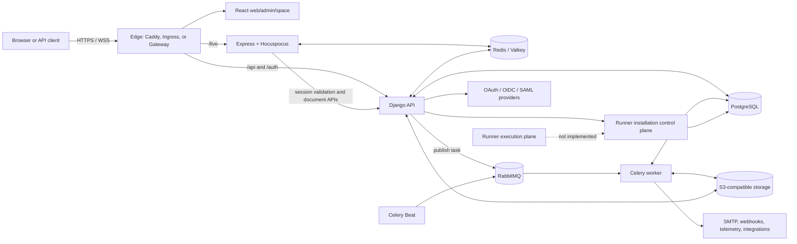

# Hangar Security Architecture

## Scope and assessment boundary

This document maps the security-relevant architecture of the Hangar fork at commit `18873d09afbd14dba678184e4ef058f726f60504` on `origin/preview`. It covers the browser applications, Django APIs, Live collaboration service, asynchronous workers, persistence services, deployment manifests, external integrations, and the implemented Hangar Runner installation foundation.

It also analyzes the two commits between Hangar's recorded upstream base, `d3d3de44cf13991025783c598d8b34229fb47729`, and the fetched `upstream/preview` tip, `bed58d9b17dbc8b221af9cde0cec9cec299d183b`, as of 2026-07-15. The incoming commits were inspected and rehearsed with a no-commit merge. They are not incorporated into the assessed Hangar revision or this analysis branch.

This is the reconnaissance phase of a static application security assessment. It records reachable surfaces, data flows, privileges, trust boundaries, and controls visible in source. It does not test exploitability or prove the absence of vulnerabilities. Vulnerability-specific SAST phases and runtime validation are required for that conclusion.

The current Runner scope is especially important: the repository implements a workspace-scoped installation lifecycle and audit trail, but it does not yet implement job dispatch, source checkout, build execution, a runner agent, sandboxing, artifact collection, or a runner-facing credential protocol. Consequently, no untrusted Runner workload is executable through the reviewed code.

## Incoming upstream delta and security relevance

| Order | Upstream commit | Scope | Security assessment | Integration recommendation |
| ----- | --------------- | ----- | ------------------- | -------------------------- |
| 1 | `e63f0c3b3404d669ae05dd9050aab72292f87e5c` — `[WEB-8066] fix: scope workspace asset get/patch/delete to project membership (#9372)` | Changes `WorkspaceFileAssetEndpoint` and adds a five-case contract test module. | Security remediation. Workspace authorization alone permits an active workspace member or guest to address a project-bound asset by UUID. The change adds an active `ProjectMember` check before `GET`, `PATCH`, and `DELETE`; it deliberately exempts assets with no project. Denied `GET` requests are tested to ensure that no presigned download URL is minted. | Preserve the upstream commit and test behavior without semantic modification. Land it before the admin cleanup, following upstream order. |
| 2 | `bed58d9b17dbc8b221af9cde0cec9cec299d183b` — `chore: clean up React Doctor warnings in admin app (#9418)` | Updates 31 admin/lockfile paths, removes six unused compatibility/components/helpers, extracts the store context, removes three unused dependencies, and improves React purity and accessibility. | Not a direct vulnerability fix. It affects the instance-admin and authentication UI, so incorrect conflict resolution could still weaken or regress privileged configuration and sign-in behavior. The extracted context now defaults to `undefined`, making existing provider guards effective. | Merge after the asset fix. Accept structural cleanup and accessibility changes while retaining Hangar branding, Google-auth policy, password policy, and telemetry semantics. |

The first commit is a follow-up in the asset object-authorization area previously covered by the published cross-workspace asset advisory `GHSA-qw87-v5w3-6vxx` / `CVE-2026-46558`. This reconnaissance treats the upstream change as a known remediation. It does not independently claim that every asset route or entity type is secure.

### Asset authorization delta

The current `WorkspaceFileAssetEndpoint` detail methods first require an authenticated active workspace Admin, Member, or Guest and then load the asset by both `asset_id` and workspace slug. A project-bound asset can represent an issue attachment, issue description, comment description, or page description. Before the incoming change, those detail methods do not independently establish that the requester belongs to the asset's project.

The upstream helper keeps the workspace check as the first tenant boundary and adds a second object-scope decision:

1. Load the asset only inside the authorized workspace.
2. If `asset.project_id` is null, treat it as a workspace-level entity and retain workspace-member access.
3. Otherwise require an active `ProjectMember` row matching the request user, asset workspace, and asset project.
4. Return `403` before mutating metadata, soft-deleting the asset, or asking storage for a presigned URL.

The accompanying contract tests cover non-project-member denial for all three detail operations, positive project-member download, the workspace-level exemption, state preservation after denied mutations, and absence of storage signing after a denied download. The change introduces no database migration or external configuration change.

### Merge rehearsal and conflict plan

A reversible `git merge --no-commit --no-ff upstream/preview` rehearsal against the assessed Hangar revision produced four conflicts:

| Conflict | Cause | Planned resolution |
| -------- | ----- | ------------------ |
| `apps/admin/components/common/page-header.tsx` | Hangar changed branding while upstream deleted the now-unused component. | Accept the upstream deletion. No imports or symbol references remain. |
| `apps/admin/components/instance/instance-not-ready.tsx` | Hangar changed branding while upstream deleted the now-unused component. | Accept the upstream deletion. No imports or symbol references remain. |
| `apps/admin/components/instance/loading.tsx` | Hangar changed the loading logo while upstream deleted the now-unused component. | Accept the upstream deletion. No imports or symbol references remain. |
| `apps/admin/components/instance/setup-form.tsx` | Hangar replaced vendor telemetry text with disabled-by-default, operator-configured OTLP wording; upstream edits the same block while adding accessibility fixes elsewhere. | Keep Hangar's telemetry wording and behavior. Accept upstream `aria-label` changes for both password visibility controls. |

The other 10 overlapping paths merge textually. They still require semantic review because clean textual merges are not proof of preserved behavior:

- Keep Hangar's Google authentication mode, allowed-domain handling, Spaces callback, and product wording while accepting hoisted static configuration and link labels.
- Keep existing Gitea, GitHub, and GitLab fork-specific configuration and branding while accepting accessibility and React-purity changes.
- Preserve Hangar sign-in, sidebar, setup, and AI configuration behavior while accepting native-button, stable-key, and accessibility cleanup.
- Accept the new `providers/store-context.ts` split and updated store hooks as one atomic refactor.
- Regenerate or frozen-install the lockfile and confirm Hangar's existing dependency changes remain while the unused admin dependencies `@tanstack/react-virtual`, `@tanstack/virtual-core`, and `axios` disappear.

Use a normal merge of `upstream/preview` into a dedicated sync branch rather than cherry-picking. This preserves the exact upstream ancestry and both-commit ordering, makes the recorded upstream base truthful, and avoids replaying the same commits during the next sync. After resolving and verifying the merge, update `UPSTREAM_BASE.json` to revision `bed58d9b17dbc8b221af9cde0cec9cec299d183b` with the actual synchronization date. An emergency security-only release could take the first commit alone, but the normal synchronization should merge both commits.

The merge should be accepted only after:

1. The new API contract test passes in the repository's isolated Docker test stack, together with the existing asset authorization tests.
2. Admin formatting, lint, type checking, and build pass after a frozen lockfile install.
3. Targeted manual review confirms instance setup, telemetry defaults/copy, password controls, and every configured authentication provider.
4. Branding and brand-asset checks pass, and no unresolved conflict markers or obsolete imports remain.
5. `UPSTREAM_BASE.json`, the merge commit, and the pull-request base all identify the same upstream synchronization boundary.

Because the security change has no schema or configuration dependency, it can be deployed with the API application and workers in the usual rollout. Rolling back that application commit would restore the known authorization gap, so a forward correction is preferable if deployment validation finds a regression.

## Technology Stack

| Layer                      | Technology                                                                                           | Security-relevant role                                                                                                                              |
| -------------------------- | ---------------------------------------------------------------------------------------------------- | --------------------------------------------------------------------------------------------------------------------------------------------------- |
| Monorepo/tooling           | pnpm 11, Turborepo 2.9, Node.js 22+, TypeScript 5.8                                                  | Builds the browser applications, Live service, and shared packages under strict TypeScript settings.                                                |
| Browser applications       | React 18, React Router 7, Vite 8, MobX                                                               | `web`, `admin`, and `space` clients originate authenticated browser requests and render tenant data.                                                |
| Core API                   | Python 3.12, Django 4.2, Django REST Framework 3.15, Gunicorn/Uvicorn                                | Terminates `/api`, `/api/v1`, `/api/public`, `/api/instances`, and `/auth` requests; enforces authentication, permissions, validation, and tenancy. |
| Authentication             | Django sessions, CSRF middleware, API keys, password and magic-code flows, OAuth 2.0, OIDC, SAML     | Establishes human and service identities. Session and provider tokens are sensitive credentials.                                                    |
| Authorization              | DRF permissions, workspace/project membership and role models                                        | Enforces workspace and project isolation, including Admin/Member/Guest role checks.                                                                 |
| Live collaboration         | Node.js, Express 4, WebSocket, Hocuspocus/Yjs                                                        | Serves `/live/collaboration`, document conversion, PDF export, and health routes; validates users against the Django API.                           |
| Background processing      | Celery 5.4, django-celery-beat, RabbitMQ/AMQP                                                        | Runs email, webhook delivery, exports, cleanup, telemetry, and automation outside request processes.                                                |
| Primary datastore          | PostgreSQL 15                                                                                        | Stores identities, tenants, work items, permissions, tokens, audit data, webhook logs, and Runner state.                                            |
| Cache and coordination     | Redis/Valkey 7, ioredis                                                                              | Supports caching, rate limits, Live document coordination, and cross-instance broadcasts.                                                           |
| Object storage             | S3-compatible storage through boto3; MinIO/SeaweedFS evaluation options                              | Stores user-uploaded assets and exported files; presigned URLs transfer data between browsers and storage.                                          |
| Edge routing               | Caddy in Compose; Kubernetes Ingress or Gateway API in Helm                                          | Routes public paths to web, admin, space, Live, and API services and is the expected TLS termination boundary.                                      |
| Deployment                 | Docker/Compose and Helm/Kubernetes                                                                   | Injects secrets and configuration, separates workloads, applies pod security contexts, and optionally enforces network policy.                      |
| Observability/integrations | JSON logging, Scout APM, PostHog, OpenTelemetry, SMTP, Slack, GitHub/GitLab/Gitea, outbound webhooks | Sends selected operational or application data across external trust boundaries.                                                                    |
| Runner foundation          | Django extension models, service layer, DRF endpoints, PostgreSQL constraints/triggers               | Controls workspace installation state and consent. No execution-plane technology is present yet.                                                    |

## Architecture Overview

Hangar is a multi-tenant project-management application. The workspace is the primary tenant boundary; projects and their work items are subordinate authorization scopes. Human users normally enter through one of three React applications. The edge routes API and authentication paths to Django and collaborative paths to the Live service. Both application services rely on the same identity and workspace model held by Django/PostgreSQL.

The Django API is the central control plane. It owns authentication flows, API-key validation, workspace/project authorization, business operations, signed object-storage operations, integration configuration, and background-task publication. The `/api/v1` surface is intended for API keys; the main `/api` application surface uses browser sessions. Public Space endpoints expose explicitly published or intake-oriented data through a separate route family.

The Live service is a distinct Node.js process. WebSocket authentication forwards the supplied session cookie to Django's current-user endpoint and verifies that the returned user ID matches the connection claim. Collaborative document storage and authorization are mediated through Django API calls, while Redis coordinates multiple Live instances. Live also exposes document conversion and PDF generation routes under the `/live` prefix.

Celery workers consume JSON-serialized tasks from RabbitMQ. They can read and mutate application state in PostgreSQL, access object storage, send email and webhooks, and call telemetry or integration endpoints. Celery Beat and the database scheduler create recurring maintenance and automation tasks. These processes have no public HTTP listener but hold broad application credentials.

The Helm deployment separates frontend, API, Live, worker, beat-worker, and migrator workloads. It disables service-account token automounting, applies non-root/read-only-root-filesystem/container-capability controls, takes credentials from existing Kubernetes Secrets, and can install default-deny plus allow-list NetworkPolicies. The Compose deployment provides the same logical services on a shared container network and exposes Caddy publicly.

### Principal components

| Component      | Publicly reachable                               | Privilege and responsibility                                                                                                 |
| -------------- | ------------------------------------------------ | ---------------------------------------------------------------------------------------------------------------------------- |
| `apps/web`     | Yes                                              | Main authenticated workspace UI; handles data returned by Django.                                                            |
| `apps/admin`   | Yes, under the configured admin path             | Instance administration UI; its backing operations are higher privilege than ordinary workspace operations.                  |
| `apps/space`   | Yes, under `/spaces`                             | Public/shared project content and intake UI; crosses from anonymous visitors into selected tenant resources.                 |
| `apps/api`     | Yes, through `/api` and `/auth`                  | System of record and primary authorization decision point; has database, cache, queue, storage, and integration access.      |
| `apps/live`    | Yes, through `/live`                             | Collaborative WebSocket and document transformation boundary; relies on Django for identity and content authorization.       |
| Celery worker  | No direct listener                               | Executes queued application work with database, storage, email, and outbound-network privileges.                             |
| Celery Beat    | No direct listener                               | Schedules recurring maintenance and automation work into RabbitMQ.                                                           |
| Migrator       | No direct listener                               | Runs schema migration with database-owner-level capabilities during deployment.                                              |
| PostgreSQL     | Internal                                         | Authoritative state, tenant data, credentials/tokens, logs, and Runner evidence.                                             |
| Redis/Valkey   | Internal                                         | Cache, rate-limiting state, and Live coordination; possession can affect availability and ephemeral authorization controls.  |
| RabbitMQ       | Internal                                         | Task integrity boundary between request/scheduler processes and privileged workers.                                          |
| Object storage | Public only where explicitly routed or presigned | User files and exports; protected through object identifiers, application authorization, and time-bounded signed operations. |

## Data Flow

### 1. Browser session and application API flow

1. A user reaches a React application through the edge.
2. The browser obtains a CSRF token and authenticates through password, magic code, OAuth, OIDC, or SAML endpoints under `/auth`.
3. Django establishes a server-side session referenced by an HTTP-only session cookie.
4. The browser calls `/api/...`; the Django application resolves the user and applies endpoint-specific workspace or project permissions.
5. Django reads or writes tenant records in PostgreSQL and may use Redis for cached or throttling state.
6. Responses return JSON or a signed/object-backed file response to the browser.

Security properties visible in this flow include global authentication defaults, Django CSRF middleware and cookie configuration, role-aware permission classes, active-membership checks, request body limits, and per-surface throttles. Some explicitly public endpoints replace the authenticated default with `AllowAny`; these form a separate anonymous trust boundary and require endpoint-level review in later phases.

### 2. API-key flow

1. A client calls `/api/v1/...` with an `X-API-Key` header.
2. Django looks up an active, unexpired token belonging to an active user and records its last-used time.
3. API-key throttling and resource permission classes execute before business logic.
4. The operation is scoped through workspace/project membership models and persisted in PostgreSQL.

API tokens, their workspace association, service/human classification, expiry, and activity logs are stored in PostgreSQL. The raw token is therefore part of the database confidentiality boundary.

### 3. Authentication-provider flow

1. The browser starts an OAuth, OIDC, or SAML flow at `/auth/...`.
2. Django constructs a provider request and stores correlation state needed for the callback.
3. The external identity provider redirects or posts the assertion/code to the corresponding callback.
4. Django validates the response through the provider implementation, maps the external identity to a local user, and creates a local session.
5. Provider access, refresh, and identity tokens that are retained are stored in PostgreSQL.

This crosses an Internet identity-provider boundary and relies on correct issuer, endpoint, certificate, state, nonce, redirect, and local-account binding behavior. Those mechanisms are candidates for dedicated authentication review, not conclusions of this reconnaissance phase.

### 4. Live collaboration flow

1. A browser opens `/live/collaboration/` over WebSocket with document parameters and a token containing a claimed user ID plus session-cookie material.
2. Live calls Django's current-user API with the cookie and requires the authoritative user ID to match the claim.
3. Hocuspocus loads or writes document data through Live extensions and Django-backed page services.
4. Redis distributes document updates and administrative close/broadcast commands among Live replicas.
5. The connection remains long-lived and retains its authenticated context until it closes or is forcibly closed.

The Live service also receives authenticated PDF-export requests using the browser cookie and calls Django to fetch page content and assets. Its health route is intentionally unauthenticated. Internal administrative operations can use a separately injected Live server secret.

### 5. File and export flow

1. An authenticated or explicitly public-space endpoint requests an upload slot.
2. Django validates entity context, workspace membership, metadata, file type/size policy, and constructs a workspace- or user-prefixed object key.
3. Django issues a time-bounded S3-compatible presigned operation with content-length and content-type conditions.
4. The browser transfers content directly to object storage and confirms metadata to Django.
5. Downloads are mediated by asset routes or signed URLs; cleanup workers remove unconfirmed assets and expired exports.

File bytes leave the Django process but remain coupled to authorization metadata in PostgreSQL. Object-store credentials permit broad bucket access and are injected only into API/worker workloads that need them in the Helm profile.

The V2 workspace asset detail route is a particularly important two-level authorization surface. `FileAsset` rows always carry an object identifier and may carry both a workspace and project relationship. The workspace slug prevents cross-workspace lookup, while the incoming upstream change adds the missing project-membership decision for project-bound detail operations. The database row is checked before the storage adapter signs a download, so denial occurs on the application side of the object-storage trust boundary.

### 6. Webhook and background-task flow

1. An authorized workspace user configures an outbound webhook and event selection.
2. A business event publishes a JSON task to RabbitMQ.
3. A Celery worker loads the authoritative workspace object from PostgreSQL, serializes the event, signs it with the webhook secret, and performs an outbound HTTP request.
4. The worker records request/response evidence and retry state in PostgreSQL, and may deactivate failing hooks and send email.
5. Scheduled cleanup tasks later enforce log and export retention.

The worker uses the repository's pinned outbound-fetch utility and configured host allow/deny policy. The configured destination is still an untrusted external system, and webhook bodies may contain workspace data intentionally selected for integration delivery.

### 7. Runner installation control flow

1. An authenticated browser session calls `GET` or `POST /api/workspaces/{slug}/runner/installation/`, or the suspend/revoke subroutes.
2. An outer process gate checks `RUNNER_ENABLED`; services repeat the gate for non-HTTP callers.
3. The service resolves the workspace through an active Admin membership. Mutations lock the workspace and re-check the active Admin membership inside the transaction.
4. Activation accepts only the exact version and digest from the immutable consent registry.
5. PostgreSQL stores one installation per workspace and enforces state, consent, actor, timestamp, and transition-shape constraints.
6. The same transaction appends an audit event containing workspace, actor, action, target, request ID, source IP, user agent, and allow-listed state metadata.
7. Application guards and a PostgreSQL trigger prevent update or deletion of Runner audit events.

Runner reads and mutations have both aggregate and per-user throttle classes. Disabled or unauthorized workspace resolution avoids exposing installation state. The process-level feature flag is restart-bound and is explicitly not a durable emergency stop for future workers; a future execution plane must add its own durable dispatch and kill-switch controls.

No data currently flows from this control plane to an executor. There is no repository code that accepts Runner jobs, distributes credentials, starts containers or VMs, checks out repositories, executes commands, uploads Runner artifacts, or streams Runner logs.

## Entry Points

| Entry point                                                    | Protocol and caller                           | Authentication/authorization boundary                                      | Primary data handled                                                      |
| -------------------------------------------------------------- | --------------------------------------------- | -------------------------------------------------------------------------- | ------------------------------------------------------------------------- |
| `/` and application routes                                     | HTTPS, browser                                | React route gating; authoritative checks occur in Django                   | Workspace/project content and user preferences                            |
| `/god-mode/` (configurable)                                    | HTTPS, instance administrator                 | Admin session and instance-level administration checks                     | Instance configuration, users, and service settings                       |
| `/spaces/` and `/api/public/...`                               | HTTPS, anonymous or shared-space visitor      | Explicit public/share/intake policy rather than normal membership          | Published project data, intake submissions, selected assets               |
| `/auth/sign-in`, `/sign-up`, magic and password reset routes   | HTTPS, anonymous browser                      | Credential/rate-limit/session-establishment boundary                       | Passwords, email addresses, one-time/reset tokens                         |
| `/auth/{google,github,gitlab,gitea,oidc,saml}` and callbacks   | HTTPS plus external IdP                       | Provider validation and local-account binding                              | Authorization codes, assertions, provider identity claims/tokens          |
| `/api/...`                                                     | HTTPS, authenticated browser                  | Session authentication plus endpoint workspace/project permissions         | Full application business data                                            |
| `/api/v1/...`                                                  | HTTPS, API client                             | `X-API-Key`, expiry/active-user validation, throttling, entity permissions | Automation-visible workspace/project data                                 |
| `/api/assets/...` and `/api/assets/v2/...`                     | HTTPS, browser/API client                     | Workspace/entity permission or explicit static/public variant              | File metadata, signed upload/download operations                          |
| `/api/workspaces/{slug}/webhooks/...`                          | HTTPS, workspace user                         | Workspace permission classes                                               | Destinations, signing secrets, event configuration, delivery logs         |
| `/api/workspaces/{slug}/runner/installation/...`               | HTTPS, authenticated workspace Admin          | Session auth, process gate, active Admin checks, consent, throttles        | Runner installation state and immutable audit evidence                    |
| `/live/collaboration/`                                         | WSS, authenticated browser                    | Django-backed session verification plus document authorization             | Collaborative document updates and presence/context metadata              |
| `/live/pdf-export/`                                            | HTTPS, authenticated browser                  | Session cookie and Django content fetch authorization                      | Page content, linked images, generated PDF bytes                          |
| `/live/convert-document/`                                      | HTTPS, application caller                     | Route-level validation; deployed network/edge exposure defines caller set  | HTML converted into editor JSON/binary formats                            |
| `/live/health/` and API health/root probes                     | HTTPS or cluster HTTP, probes/operators       | Intentionally unauthenticated availability endpoint                        | Version and health metadata                                               |
| RabbitMQ task queues                                           | AMQP, API/Beat producers and worker consumers | Broker credentials and network reachability                                | Serialized task identifiers, event payloads, scheduling metadata          |
| Celery Beat database scheduler                                 | Internal process and PostgreSQL               | Deployment credentials; no public listener                                 | Recurring task definitions and execution times                            |
| Django management commands/migrator                            | Container process, operator/deployment        | Image execution plus database/application secrets                          | Schema, instance registration/configuration, storage initialization       |
| PostgreSQL, Redis, RabbitMQ, object-store ports                | Internal service network                      | Service credentials and NetworkPolicy/container-network isolation          | Authoritative state, ephemeral state, tasks, and file bytes               |
| Outbound SMTP, webhook, telemetry, OAuth and integration calls | HTTPS/TLS or SMTP, server-side processes      | Destination TLS plus provider/service credentials                          | Notifications, selected tenant events, identity data, operational metrics |

## Trust Boundaries

### Internet and edge boundary

Browsers, API clients, identity providers, webhook destinations, and uploaded content are untrusted. Caddy or the Kubernetes ingress/gateway is expected to terminate TLS and route by path. Django's production configuration trusts forwarded scheme/host/port information from that edge, so only the intended proxy should be able to supply those headers. Request-size limits, security headers, CORS/CSRF configuration, and route-specific authentication begin at this boundary.

### Anonymous-to-authenticated boundary

Authentication endpoints, public Spaces, intake routes, public assets, health checks, and provider callbacks are reachable without an established normal application session. Successful authentication creates a server-side session; API-key validation establishes a separate non-browser identity. Public endpoints must not inherit assumptions made by authenticated workspace endpoints.

### Tenant and project boundary

Workspace membership is the primary isolation control. Most application operations resolve a workspace slug plus active membership; project-level operations add project membership and role checks. Admin, Member, and Guest/Viewer privileges differ for mutations. Identifiers in paths are not sufficient authority by themselves. Assets illustrate why both scopes matter: a UUID and a valid workspace membership do not by themselves authorize access to a project-bound object. Runner is workspace-scoped and restricted to active workspace Admins.

### Application-service boundary

Django, Live, workers, Beat, and the migrator are separate processes with different exposure and privilege. Live delegates identity and page authorization to Django but holds session-cookie material during a connection. Workers trust task messages sufficiently to perform privileged database, storage, email, and outbound-network operations. The migrator has schema-changing authority. Compromise of any server-side workload can therefore cross boundaries according to its injected credentials.

### Queue and cache boundary

RabbitMQ determines which work privileged Celery workers execute. Redis/Valkey influences cached state, rate limiting, collaborative document distribution, and Live administrative broadcasts. Both are internal-only services whose integrity and availability matter even when their contents are transient. Kubernetes NetworkPolicies restrict callers when enabled; Compose relies primarily on the shared private container network and credentials.

### Database boundary

PostgreSQL is the authoritative confidentiality and integrity boundary for nearly all application state. Application services generally share broad database credentials, while tenant isolation is enforced in application queries and constraints rather than separate databases. Runner adds database-level state checks and append-only enforcement so its security evidence does not rely only on model methods.

### Object-storage boundary

Object storage contains attacker-controlled uploaded bytes and potentially confidential attachments/exports. The application database holds the authorization metadata, while storage holds the bytes. Presigned operations intentionally delegate narrow, time-limited access to browsers. Storage credentials, endpoint configuration, bucket policy, key construction, and public routing determine the effective boundary.

### External-service boundary

OAuth/OIDC/SAML providers assert identity; SMTP carries user notifications; webhooks and integrations receive selected tenant data; telemetry/analytics receive operational data. Each call leaves operator-controlled infrastructure. External responses, redirects, certificates, DNS results, and payloads remain untrusted until validated.

### Deployment and secret-management boundary

Environment variables and Kubernetes Secrets provide Django secret keys, database/cache/queue URLs, Live internal secrets, object-store credentials, email credentials, and provider/integration configuration. Helm avoids embedding secret values in ConfigMaps and disables service-account-token automounting. Operators, CI, container registries, cluster admission controls, and secret-store access are outside the application trust boundary but can fully affect it.

### Runner control-plane and future execution-plane boundary

The implemented Runner boundary ends at installation state and audit evidence in Django/PostgreSQL. `RUNNER_ENABLED`, current consent, active Admin membership, transition rules, throttles, and immutable audit records protect that control plane. A future executor would introduce a substantially stronger boundary between tenant-controlled workflow input and privileged compute, network, secrets, source code, caches, logs, and artifacts. That boundary does not yet exist and must be threat-modeled before execution functionality is added.

## Sensitive Data Inventory

| Data                                                             | Location                                                         | Primary access paths                                                         | Protection/handling observed                                                                                                                    |
| ---------------------------------------------------------------- | ---------------------------------------------------------------- | ---------------------------------------------------------------------------- | ----------------------------------------------------------------------------------------------------------------------------------------------- |
| Password hashes and password-reset state                         | PostgreSQL `users` and Django auth/session tables                | Authentication endpoints and Django auth backend                             | Django password hashing/validation and time-limited reset flow; never intended for client return                                                |
| Session identifiers and CSRF tokens                              | HTTP-only cookies plus PostgreSQL-backed custom session engine   | Browser, Django, and Live session validation                                 | Secure-cookie mode follows configured origins; CSRF middleware and trusted-origin configuration are present                                     |
| API tokens                                                       | PostgreSQL `api_tokens`                                          | `/api/v1`, token management, integrations                                    | Active-user and expiry checks, rate limiting, last-used tracking; raw token is database-sensitive                                               |
| OAuth/OIDC provider tokens and identity claims                   | PostgreSQL account records and transient auth state              | Provider callbacks and integrations                                          | Access/refresh/ID tokens retained for connected accounts; provider validation controls identity binding                                         |
| SAML assertions, IdP metadata, certificates, OIDC client secrets | Request/session state and instance configuration                 | SSO initiation/callback/metadata endpoints                                   | Parsed and validated by dedicated provider modules; configuration must remain operator-controlled                                               |
| User personal data                                               | PostgreSQL                                                       | App/API/admin/notification flows                                             | Email, names, profile, IP/user-agent login history, locale, billing/profile metadata; scoped through identity and tenant permissions            |
| Workspace/project/work-item content                              | PostgreSQL                                                       | Authenticated APIs, public Spaces, Live, exports, webhooks                   | Workspace/project membership controls; selected records may intentionally cross public/share/integration boundaries                             |
| Uploaded files and exports                                       | S3-compatible object storage plus PostgreSQL metadata            | Asset endpoints, presigned operations, public/static variants, cleanup tasks | Workspace/user key prefixes, file-size/content-type conditions, time-bounded URLs, and workspace/project authorization metadata; the incoming remediation adds project membership to V2 detail operations |
| Webhook signing secrets                                          | PostgreSQL `webhooks`                                            | Webhook configuration and Celery delivery                                    | Used to HMAC-sign outbound payloads; regeneration endpoint exists; secret confidentiality depends on DB/API controls                            |
| Webhook request/response logs                                    | PostgreSQL `webhook_logs`                                        | Workspace webhook log API and cleanup tasks                                  | May contain delivered tenant payloads and external response data; scheduled retention cleanup is configured                                     |
| Integration and Slack credentials                                | PostgreSQL integration/account tables                            | Integration setup, bot API tokens, workers                                   | Includes API tokens, access tokens, webhook URLs/secrets, and provider metadata; grants external and tenant access                              |
| Application and infrastructure secrets                           | Environment/Kubernetes Secrets                                   | API, Live, worker, Beat, migrator startup                                    | Separate secret references for app, Live, database, cache, queue, and object storage in Helm                                                    |
| Database/cache/queue/object-store credentials                    | Environment/Kubernetes Secrets                                   | Server-side workloads                                                        | Network isolation plus workload-specific secret injection; compromise grants infrastructure-level access                                        |
| Live server secret and session-cookie material                   | Environment and Live process memory                              | Internal Live operations, WebSocket/PDF requests                             | Dedicated injected secret; Live validates browser identity against Django and retains cookie material only as needed for calls                  |
| Email credentials and message contents                           | Environment/instance configuration, worker memory, delivery logs | Celery notification tasks and SMTP                                           | Workers retrieve SMTP configuration and send user/workspace notifications across the SMTP boundary                                              |
| Analytics, telemetry, and APM credentials/data                   | Environment and outbound requests                                | API/worker instrumentation and scheduled telemetry                           | Feature/configuration gated; data leaves the deployment when enabled                                                                            |
| Runner consent and installation state                            | PostgreSQL `ext_runner_installations`                            | Runner Admin endpoints and service layer                                     | One row per workspace, exact consent version/document/digest, database transition constraints, restart-bound instance gate                      |
| Runner audit evidence                                            | PostgreSQL `ext_runner_audit_events`                             | Runner transition service and operator/database review                       | UUID actor/workspace/target evidence, request context, allow-listed metadata, application immutability guards, PostgreSQL update/delete trigger |

## Security controls confirmed in source

The reconnaissance confirms that the current Runner installation control plane contains the intended structural controls: it is disabled unless explicitly enabled, requires an authenticated active workspace Admin, repeats authorization inside locked mutation transactions, requires an exact immutable consent contract, constrains persisted state in PostgreSQL, rate-limits reads and mutations at user and aggregate scopes, and writes append-only audit evidence in the same transaction. The reviewed routes do not connect to a job execution path.

At the platform level, the source also contains layered identity/permission checks, server-side sessions and API-key authentication, request throttling and size limits, signed object-storage operations, outbound-fetch policy utilities, secret separation, hardened Kubernetes pod defaults, and optional default-deny NetworkPolicies.

These observations confirm control presence and architectural placement, not their universal correctness or resistance to bypass. Security cannot be confirmed as an absence of vulnerabilities from architecture reconnaissance alone. After the upstream merge, the highest-priority focused phase is authorization/IDOR analysis of every asset route and entity type, followed by missing-auth coverage. Subsequent phases should cover authentication and token lifecycles, SSRF in webhooks/SSO/assets, file upload and object authorization, XSS in rich content/public Spaces, SQL/injection and execution sinks, secrets exposure, and Runner-specific business-logic races before any execution plane is introduced.

## Assessment references

- Recorded Hangar upstream base: `UPSTREAM_BASE.json` at `d3d3de44cf13991025783c598d8b34229fb47729`.
- Prospective upstream synchronization target: `bed58d9b17dbc8b221af9cde0cec9cec299d183b`.
- Security remediation commit: `e63f0c3b3404d669ae05dd9050aab72292f87e5c`.
- Published upstream asset advisory identifiers: `GHSA-qw87-v5w3-6vxx` / `CVE-2026-46558`.
